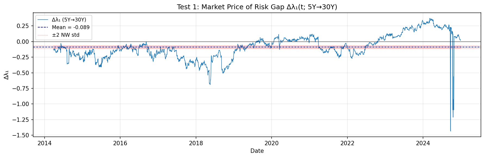
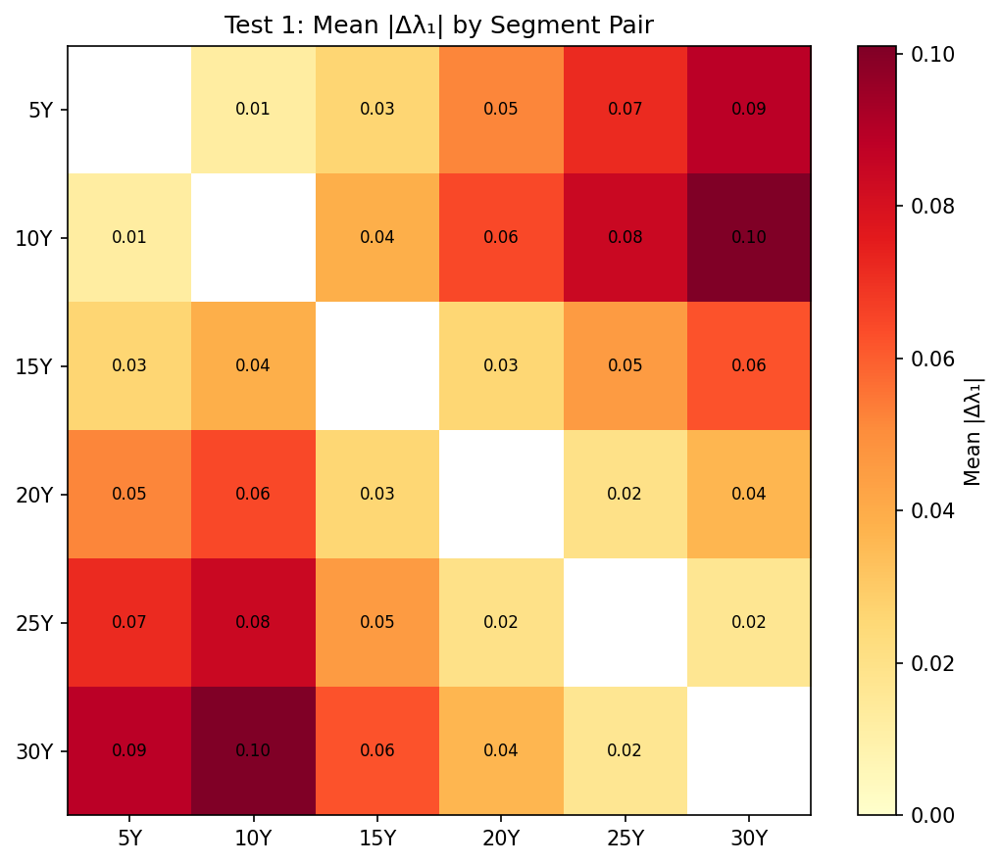
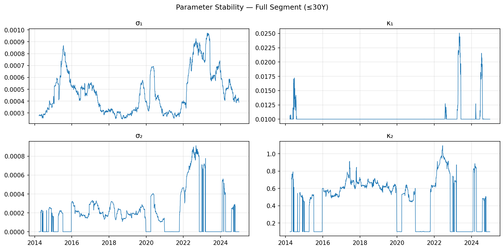
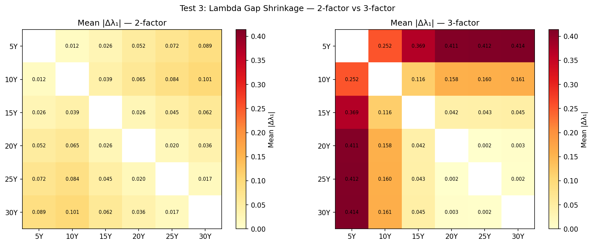
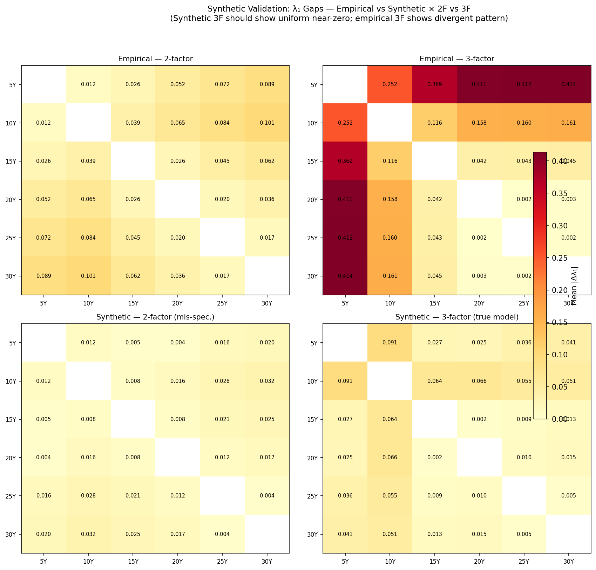

---
title: Does the Bond Market Need a Bank Account?
subtitle: Forward Measure Consistency and Interest Rate Pricing
author: Shaohui Wang^[shaohui.wang@hotmail.com]
date: March 2026
---

# Abstract

As Samuelson (1938) asked whether observed consumer choices imply the
existence of a utility function, we ask whether observed bond prices
imply the existence of a risk-neutral measure. In a bond market, each
tradable zero-coupon bond provides a natural numéraire and pricing
measure — the T-forward measure $Q^T$. Practitioners use these local
frameworks daily. We develop forward-measure consistency — the
requirement that independently calibrated local pricing measures
cohere across maturities — as a diagnostic for term-structure model
validity that conventional goodness-of-fit metrics do not provide.

We contribute three things. First, a discrete-time Bond-Based FTAP
showing the family is automatically consistent, with the bank account
emerging as a self-financing rolling strategy — a proof of concept that
the question has substance. Second, a precise formulation of the
continuous-time consistency problem, with the hypothesis that the HJM
drift condition is the consistency condition and an analysis of why
failure is plausible (the diagonal singularity of the forward rate
surface). Third, an empirical test: independent calibration of local
pricing measures for different maturity segments of the EUR government
bond market, checking whether the implied market prices of risk agree
across segments. The test rejects consistency for most segment pairs;
a three-factor comparison separates model inadequacy from residual
inconsistency aligned with known market segmentation.

Our question belongs to the model-free tradition: start from observable
market data, ask whether the theoretical framework is supported. The
question itself — does $\{Q^T\}$ cohere? — is model-free and, to our
knowledge, new in this direction. The empirical test is a first
implementation within the Gaussian HJM class; it establishes that the
question has empirical content but does not claim to be definitive.
Alternative model classes, model-free tests, and cross-currency
evidence could strengthen, qualify, or overturn the findings.

# 1. Introduction

## 1.1 Bottom-Up Pricing

The foundational insight of Black and Scholes (1973) and Merton (1973)
is that derivative prices are determined by replication using tradable
assets. The risk-neutral measure Q, introduced by Harrison and Kreps
(1979), encodes this replication logic mathematically but is not the
financial content itself (for a comprehensive treatment, see Bingham
and Kiesel 2004).

In bond markets, the tradable assets are zero-coupon bonds $p(\cdot,T)$. The
bank account $B(t) = \exp\left( \int_{0}^{t} r(s) \, ds \right)$ — the standard numéraire of the
FTAP — is not directly traded. Practitioners already work around this:
to price a caplet at T, they use the T-bond as numéraire and $Q^T$ as
pricing measure. Each operation is faithful to the Black-Scholes-Merton
logic: replicate using tradable instruments, extract the price.

This paper takes the practitioners' approach seriously and asks: is the
resulting family $\{Q^T\}$ of local pricing frameworks globally consistent?

## 1.2 The Bottom-Up Tradition

Our question belongs to a well-established methodology. Samuelson (1938)
asked whether observed choices imply preferences exist — founding
revealed preference theory. Hobson (1998) and the model-free finance
programme (Davis and Hobson 2007, Acciaio et al. 2013) ask what can be
inferred from observed option prices without assuming a model. Balbás,
Ibáñez, and López (2002) use projective limits of measure families to
characterize no-arbitrage over infinite time horizons.

In each case, the direction is bottom-up: start from observables, ask
whether the theoretical construct is forced by the data. Our question
specializes this to bond markets, where the specific structure — maturity
condition p(T,T)=1, the rolling construction, the forward measure family
— gives the question concrete financial content. The question itself is
model-free; the empirical test we develop (Section 5) is parametric,
operating within the Gaussian HJM class. This is a scope limitation, not
a methodological contradiction — the test is a first implementation, not
the only possible one.

## 1.3 Related Work

Musiela and Rutkowski (1997) and Döberlein, Schweizer, and Stricker
(2000) proved uniqueness of the implied savings account — but took
existence as given. Our question is the complement: existence given
local data.

Henrard (2007) identified the symptom of forward measure inconsistency:
LIBOR discounting gives wrong prices post-2007. Morini (2009) identified
the puzzle: why did the single curve break? Both diagnose and treat
within the existing framework. We identify the underlying condition: the
single-curve assumption IS the assumption that $\{Q^T\}$ coheres.

Herdegen (2017) develops a numéraire-independent FTAP for general
markets. Our question exploits bond-specific structure that his framework
does not use.

## 1.4 Contributions and Structure

We contribute a diagnostic framework, a proof of concept, and a test.

*The diagnostic* (Sections 3, 5): forward-measure consistency —
whether independently calibrated local pricing measures cohere across
maturities — provides a model validation tool with discriminating
power that standard goodness-of-fit metrics lack. We hypothesize that
the HJM drift condition is the formal consistency condition and
analyze why failure is plausible.

*The proof of concept* (Section 2): in discrete time, consistency is
automatic. The result is elementary — its value is diagnostic,
identifying the precise point (the finite chain rule) where the
argument uses discreteness.

*The test* (Section 5): independent calibration of local pricing
measures for different maturity segments of the EUR government bond
market reveals that the implied market prices of risk do not cohere
across the full maturity spectrum. A three-factor comparison separates
model inadequacy from residual inconsistency, demonstrating both uses
of the diagnostic.

The question (Section 3) is intended as a permanent contribution: it
is well-posed, falsifiable, and — to our knowledge — new in the
$\{Q^T\} \to Q$ direction. The test (Section 5) is a first
implementation within the Gaussian HJM class; it establishes that the
question has empirical content but does not claim to be definitive.
Alternative model classes, model-free tests, and cross-currency
evidence could strengthen, qualify, or overturn the empirical findings.

Section 4 connects to the multi-curve phenomenon, model risk, and
Solvency II. Section 6 identifies directions for future work.

# 2. Discrete Time: Proof of Concept

## 2.1 Setup

Let $(\Omega, \mathcal{F}, (\mathcal{F}_t)_{t=0,\ldots,N}, \mathbb{P})$ be a filtered probability space. The
market consists of default-free zero-coupon bonds $p(t,T)$ with $p(T,T) = 1$
and $p(t,T) > 0$, plus risky assets $X^1,\ldots,X^d$. No bank account is
assumed.

A trading strategy is a predictable process specifying holdings in each
asset. It is self-financing if portfolio value changes arise solely from
price movements. An arbitrage is a zero-cost self-financing strategy
producing $V_N \geq 0$ a.s. with $\mathbb{P}(V_N > 0) > 0$.

## 2.2 The Rolling Bond Strategy

**Proposition 2.2.1.** Define $B(0) := 1$ and $B(t) := \prod_{s=1}^{t} 1/p(s-1,s)$.
Then $B$ is the value process of a self-financing strategy holding, during
each period $(t-1,t]$, exactly $B(t-1)/p(t-1,t)$ units of the just-maturing
bond $p(\cdot,t)$. The one-period return $1/p(t-1,t)$ is deterministic given
$F_{t-1}$ — the discrete-time risk-free rate, derived from bonds.

## 2.3 The Four Equivalences

**Proposition 2.3.1 (Bond-Based FTAP, Discrete Time).** The following
are equivalent:

**(NA)** No arbitrage exists in the bond market.

**(EMM)** $\exists Q \sim P$ such that $S(t)/B(t)$ is a $Q$-martingale for all
traded assets $S$.

**(Wang)** $\exists Q \sim P$ such that $E^Q[R_t^S \mid F_{t-1}]$ equals the
just-maturing bond return $[1 - p(t-1,t)]/p(t-1,t)$ for all traded $S$.

**(BF)** For each $T \in \{1,\ldots,N\}$, $\exists Q^T \sim P$ such that $S(t)/p(t,T)$
is a $Q^T$-martingale for all traded assets $S$ and $t \le T$.

Moreover, the forward measures satisfy the consistency relation

  $$\frac{dQ^{T_1}}{dQ^{T_2}}\bigg|_{F_{T_1}} = \frac{p(0,T_2)}{p(0,T_1) \cdot p(T_1,T_2)}   \quad (2.1)$$

involving only bond prices, with no reference to $B$.

*Proof sketch.* $(\text{NA}) \iff (\text{EMM})$: Rolling construction makes $B$ tradable;
Harrison-Pliska (1981) applies. $(\text{EMM}) \iff (\text{Wang})$: Algebraic
reformulation (Wang 2008). $(\text{EMM}) \Rightarrow (\text{BF})$: Bayes' formula with density
$Z^T_t := p(t,T)/[B(t) \cdot p(0,T)]$. $(\text{BF}) \Rightarrow (\text{NA})$: Under $Q^N$, $V^\varphi_t/p(t,N)$
is a martingale; $V_0 = 0$ forces $V_N = 0$ a.s. Full proofs in Appendix A. $\quad\square$

**Remark.** The proposition is elementary — its components are standard
(Harrison-Pliska for $(\text{NA}) \iff (\text{EMM})$, Bayes' formula for the numéraire
change, Wang 2008 for the algebraic reformulation). Its purpose is to
establish the four-way equivalence and to identify the precise point
where the argument uses discreteness: the chain rule across maturity
triples is a finite number of conditions. This is the point that fails
in continuous time.

## 2.4 Consistency Is Automatic — But Only in Discrete Time

The consistency relation (2.1) is *implied* by (BF): under $Q^{T_2}$, the
ratio $p(t,T_1)/p(t,T_2)$ is a martingale whose terminal value determines
the Radon-Nikodym derivative. The chain rule
$$\frac{dQ^{T_1}}{dQ^{T_3}} = \frac{dQ^{T_1}}{dQ^{T_2}} \cdot \frac{dQ^{T_2}}{dQ^{T_3}}$$
is a finite number of conditions, each automatically satisfied.

In continuous time, this becomes an uncountable family. The infinitesimal
limit $T_2 \downarrow T_1$ involves $\frac{\partial p(T_1,T)}{\partial T}\bigg|_{T=T_1}$, related to the short rate
$r(T_1) = f(T_1,T_1)$. Automatic consistency is a consequence of finitude,
not of structure.

**Remark (Relationship to Herdegen 2017).** In bond markets with
strictly positive prices, Herdegen's numéraire-independent
no-arbitrage ($\text{NA}^{\text{ni}}$) coincides with NA. Our Bond-Family
formulation (BF) is the only condition among the four equivalences
that extends to continuous time without assuming $B$.

# 3. Continuous Time: The Hypothesis

## 3.1 Where the Proof Breaks

In continuous time, the rolling strategy requires trading at every
instant through uncountably many bonds (cf. Björk et al. 1997,
Döberlein and Schweizer 2001). The Bond-Family condition survives — each
$Q^T$ uses only the tradable T-bond — but consistency over a continuum of
maturities is no longer automatic.

## 3.2 The Hypothesis

**Hypothesis 3.2.1.** In a continuous-time bond market driven by a
finite-dimensional Brownian motion, the family $\{Q^T\}_{T \in [0,T^*]}$ is
consistent if and only if the forward rate drift satisfies the HJM
condition: $\alpha(t,T) = \sigma(t,T) \cdot \int_t^T \sigma(t,s) \, ds$.

The "if" direction is standard: the HJM condition ensures existence of
a martingale measure from which forward measures are derived. The "only
if" direction — that consistency of the forward measure family *forces*
the drift condition — is the non-trivial claim, and we leave it as an
open problem (Section 6). If established, it would mean the HJM drift
condition is derived from first principles — from the requirement that
replication-based pricing be coherent across maturities, using only
tradable assets.

## 3.3 The Diagonal Singularity

The bank account requires $r(t) = f(t,t)$ — the diagonal restriction of
the forward rate surface. Each bond price $p(t,T) = \exp\left(-\int_t^T f(t,s) \, ds\right)$
involves an integral that smooths irregularities; the short rate is a
pointwise evaluation with no smoothing. The issue is not the mathematical
existence of $r(t)$ given sufficient regularity, but whether the bank
account $B$ — as a portfolio strategy — is replicable from tradable
bonds. The rolling bond strategy requires continuous rebalancing through
an uncountable family of maturities, and its convergence is not
guaranteed by the well-behavedness of individual bond prices.

When the forward rate surface has Hölder regularity $H < 1/2$ in the
maturity variable, the diagonal restriction may fail to exist even
though all bond prices and forward measures remain well-defined — a
classical distinction in functional analysis (the Sobolev trace
theorem). Gatheral, Jaisson, and Rosenbaum (2018) established that
*equity* volatility surfaces have $H \approx 0.1$; whether bond
forward rate surfaces exhibit comparable roughness is open. The
diagonal singularity is thus a *possible* mechanism for consistency
failure, not an established one. We present it as motivation for the
empirical test, not as an independent argument.

## 3.4 Positioning

The standard approach goes $Q \to \{Q^T\}$: top-down, existence by assumption.
Musiela-Rutkowski (1997) and Döberlein-Schweizer (2000) proved uniqueness
of the implied savings account but took existence as given. We reverse
the direction: $\{Q^T\} \to Q$, bottom-up, existence as a question. The
question is model-free in the sense of the bottom-up tradition (Hobson
1998, Acciaio et al. 2013), with the projective limit methodology of
Balbás et al. (2002) as the mathematical template. The empirical test
we develop in Section 5 is parametric — a scope choice, not an
inherent limitation of the framework.

# 4. Practical Consequences

## 4.1 The Multi-Curve Phenomenon

Before 2007, one $Q$, one $B$, apparent consistency. After the crisis,
LIBOR-OIS spreads blew out and the market fragmented. Henrard (2007)
identified the symptom, Morini (2009) the puzzle. Our framework
identifies the underlying condition: the single-curve assumption IS the
assumption that $\{Q^T\}$ coheres. When it fails, no single numéraire achieves practical coherence
across the full curve, and the market necessarily fragments (Filipović and Trolle 2013, Crépey
et al. 2015, Grbac and Runggaldier 2015).

## 4.2 Model Risk

We use continuous-time models to compute discrete-time decisions. If the
model's forward measure family is consistent, hedge ratios computed from
it are robust to implementation choices. If inconsistent, hedge ratios
depend on the calibration window and maturity segment — a form of model
risk that standard validation does not detect. Standard numerical studies
of HJM discretization (e.g., Krivko and Tretyakov 2011) treat
non-convergence as an approximation problem. We treat it as a diagnostic
of structural inconsistency — a distinction that arises only from the
bottom-up perspective.

## 4.3 Solvency II

Market-consistent valuation assumes a risk-free discount curve. The
EIOPA extrapolation (UFR + Smith-Wilson) prescribes the curve beyond the
last liquid point, ensuring the smoothness needed for B to exist. If
consistency is not guaranteed within the liquid range, the extrapolation
patches a problem that may already be present.

# 5. Empirical Test

## 5.1 Principle

A top-down test — pricing under different numéraires within a single
calibrated model — tests a mathematical identity and yields zero by
construction. A bottom-up test calibrates local pricing measures
*independently* for different maturity segments, then checks whether
they cohere. The question is not "does my model satisfy its own
assumptions?" (always yes) but "does the data support the assumption
that a single model suffices across the full maturity spectrum?"
(empirically testable).

Since we employ a specific parametric model for calibration, rejection
is a joint test: it may reflect model inadequacy, genuine structural
inconsistency in the data, or both. This is a feature, not a defect.
The diagnostic is designed to detect departures from single-model
coherence — the three-factor comparison in Section 5.5 then
partially disentangles the two sources.

## 5.2 Data and Calibration

We use daily par yield curves for EUR-denominated government bonds
published by the European Central Bank (ECB) over the period
January 2014 to December 2024 (2,805 trading days). The dataset
comprises 12 maturities: 3 months, 6 months, and 1, 2, 3, 5, 7,
10, 15, 20, 25, and 30 years. We convert par yields to zero-coupon
yields using standard bootstrap methods.

To implement the consistency test of Section 3, we partition the
maturity spectrum into overlapping segments
$\mathcal{S}_T = [0, T]$ for $T \in \{5, 10, 15, 20, 25, 30\}$ years.
For each segment and each trading day, we calibrate a Gaussian HJM
model independently by minimising the sum of squared yield errors
across all maturities within the segment. The calibration is
performed via constrained optimisation (L-BFGS-B), with parameter
bounds chosen to ensure stationarity and positivity of volatility.

This independent-calibration design is central to the test. Under
the null hypothesis of forward-measure consistency, a family
$\{Q^T\}$ derived from a single measure $Q$ must produce identical
market prices of risk $\lambda$ regardless of which maturity segment
is used for calibration. Discrepancies in $\lambda$ across segments
constitute evidence against the null.

**Two-factor specification.** The baseline model uses two volatility
factors:
$$\sigma_1(\tau) = \sigma_1 e^{-\kappa_1 \tau} \quad \text{(level)}, \qquad
\sigma_2(\tau) = \sigma_2 e^{-\kappa_2 \tau} \quad \text{(slope)},$$
yielding a parameter vector
$(\sigma_1, \sigma_2, \kappa_1, \kappa_2, \lambda_1, \lambda_2)$
per segment per day. We impose $\kappa_1 \in [0.01, 2]$,
$\kappa_2 \in [0.05, 2]$, $\sigma_i \in [0, 0.05]$,
$\lambda_i \in [-2, 2]$.

**Three-factor specification.** To distinguish model inadequacy from
structural inconsistency, we augment the model with a curvature factor:
$$\sigma_3(\tau) = \sigma_3 \, \tau \, e^{-\kappa_3 \tau}
\quad \text{(curvature)},$$
which has a hump-shaped profile peaking at $\tau = 1/\kappa_3$.
This three-factor decomposition into level, slope, and curvature
captures the dominant modes of yield curve variation identified by
Litterman and Scheinkman (1991). Additional bounds:
$\sigma_3 \in [0, 0.05]$, $\kappa_3 \in [0.05, 2]$.

**Statistical test.** For each pair of segments
$(\mathcal{S}_{T_1}, \mathcal{S}_{T_2})$ with $T_1 < T_2$, we compute
the daily gap
$\Delta\lambda_k(t) = \lambda_k^{(T_1)}(t) - \lambda_k^{(T_2)}(t)$
for each factor $k$. The null hypothesis
$H_0: E[\Delta\lambda_k] = 0$ is tested via a two-sided $t$-test on the
time series of gaps, with Newey–West standard errors to account for
serial correlation. We apply Bonferroni correction across all 15 segment
pairs at the 5% significance level.

## 5.3 Two-Factor Results

Under the two-factor specification, the null hypothesis is rejected
for 13 of 15 segment pairs at the Bonferroni-corrected 5% level.
The two non-rejections occur for adjacent long-end pairs (25Y–30Y
and 20Y–25Y), where the maturity overlap is large and the
incremental information is minimal.

The results exhibit a clear monotonic pattern. The mean gap in the
level market price of risk between the 5Y and 30Y segments is
$\overline{\Delta\lambda_1}(5\text{Y} \to 30\text{Y}) = -0.089$
with a $t$-statistic of $-7.6$. The gap grows systematically with
segment distance: adjacent pairs show gaps of 1–2 basis points,
while the 5Y–30Y pair shows approximately 9 basis points. Long
segments consistently price the level risk factor lower than short
segments.

**Pattern invariance.** The absolute values of $\lambda$ are
parametrization-dependent: they absorb normalization choices in the
volatility specification and interact with the mean-reversion
parameters. However, the *pattern* of the $\lambda$ gap — monotonic
in segment distance, with long segments consistently pricing level
risk lower than short segments — is invariant to the parametrization.
This monotonicity is confirmed under both $\kappa_1$ bound choices
(Section 5.4) and under both the two-factor and three-factor
specifications (Section 5.5). A parametrization artefact would
produce erratic, non-monotonic gaps; the systematic pattern indicates
that the gap reflects a genuine feature of the data, even if its
magnitude is model-dependent.

Calibration quality is acceptable across segments: the mean $R^2$
ranges from 0.94 (5Y segment) to 0.84 (30Y segment). The decline
in fit for longer segments is expected given that a two-factor model
must span a wider maturity range, but $R^2 = 0.84$ would not
typically be flagged as inadequate by standard calibration
diagnostics.[^spike2024]

**Identification diagnostic.** The mean-reversion parameter $\kappa_1$
for the level factor is estimated at or near its lower bound (0.01)
for segments of 10 years and above on more than 95% of trading days.
This is a known feature of level factors in short-sample Gaussian
models: the level of the yield curve is near-integrated, and the
cross-section alone provides limited identification of the speed of
mean-reversion. The concern is that the $\lambda_1$ gap may reflect
differences in how $\kappa_1$ interacts with the maturity grid rather
than a genuine inconsistency in risk pricing.

[^spike2024]: On seven trading days in September–October 2024,
$|\Delta\lambda_1(\text{5Y},\text{30Y})| > 1.0$. Two dates
(September 23–24) coincide with the Federal Reserve's 50 basis point
rate cut and show acceptable calibration quality ($R^2 \approx 0.80$),
consistent with asymmetric repricing across the maturity spectrum. Five
dates (October 15–25) show near-zero $R^2$ for the 30Y segment ($R^2 <
0.16$), indicating calibration breakdown rather than a market signal —
the October 17 ECB rate decision is a particularly clear case. These
observations do not affect the aggregate test statistics. Results are
robust to excluding dates with $R^2 < 0.5$ for any segment.

## 5.4 Robustness: Mean-Reversion Bound Sensitivity

To address the $\kappa_1$ identification concern, we re-run the
entire test with the lower bound raised from 0.01 to 0.05. If the
$\lambda_1$ gap is an artefact of weak $\kappa_1$ identification,
it should attenuate under the tighter bound.

The results are unchanged in all material respects. Under the
tighter bound, 13 of 15 pairs are again rejected, with nearly
identical $t$-statistics. The mean gaps change by at most 1 basis
point. The monotonic pattern in segment distance is preserved.

The robustness check also yields a useful by-product. We record
the change in sum of squared residuals ($\text{SSR}$) between the two
calibrations. For the 5Y segment, the $\text{SSR}$ increase is negligible
($\Delta \text{SSR} = 0.38$), confirming that $\kappa_1$ is
essentially unidentified at the short end. For the 30Y segment,
the increase is substantial ($\Delta \text{SSR} = 4.15$),
indicating that the data do contain information about $\kappa_1$
at the long end — but the near-zero estimate is genuinely preferred.
In both cases, however, the $\lambda_1$ gap is invariant.

Under the tighter bound, $\kappa_1$ is pinned at exactly 0.05 for
97–100% of dates in segments of 10Y and above. This confirms that
we have shifted the boundary without resolving the identification
problem — but it also confirms that the identification problem is
irrelevant to the consistency test. The inconsistency signal is
robust.

**Table: Parameter Sensitivity Analysis** (κ₁ bounds: 0.01 vs 0.05)

## 5.5 Three-Factor Comparison

The two-factor rejection could reflect either model inadequacy (a
missing factor creates spurious inconsistency) or structural
inconsistency (the yield curve segments are genuinely governed by
different risk prices). To discriminate, we repeat the test with the
three-factor specification and compare the $\lambda$ gaps.

If the rejection is purely a two-factor artefact, the gaps should
vanish uniformly when the curvature factor absorbs the missing
cross-sectional variation. If the rejection reflects genuine
structural differences, the gaps should persist even with the
richer model.

The three-factor results reveal a structural split in the data.

**Long-end pairs (≥ 15Y).** For segment pairs within the long
end of the curve — 15Y–20Y, 15Y–25Y, 15Y–30Y, 20Y–25Y, 20Y–30Y,
25Y–30Y — the $\lambda_1$ gaps shrink to near zero. The curvature
factor absorbs the inconsistency entirely. $R^2$ improves
substantially (from 0.84 to 0.94 for the 30Y segment), confirming
that the third factor captures genuine cross-sectional variation.
For these pairs, the two-factor rejection reflects model inadequacy
masquerading as inconsistency.

**Short-vs-long pairs.** For pairs involving the 5Y segment against
segments of 20Y and above, the $\lambda_1$ gaps do not shrink.
They *widen*, from approximately $-0.09$ under the two-factor
model to $-0.25$ to $-0.41$ under the three-factor model. The
curvature factor is calibrated with fundamentally different
characteristics across these segments: the 5Y segment produces
$\kappa_3 \approx 0.47$ (curvature peaking at $\tau \approx 2$
years), while segments of 15Y and above produce
$\kappa_3 \approx 1.1$–$1.6$ (peaking at $\tau \approx 0.6$–$0.9$
years). The third factor is doing different jobs in different
segments, and the $\lambda_1$ gap absorbs the resulting
misidentification.

**Intermediate pairs.** Pairs involving the 10Y segment against
long-end segments show slight widening of gaps but less dramatic
than the 5Y pairs, consistent with a gradual transition between
the two regimes.

**Table: Lambda Gaps Across Models** (2-factor vs 3-factor specifications)

## 5.6 Interpretation

The empirical results demonstrate three layers of discriminating
power in the forward-measure consistency test.

**Layer 1: The test rejects.** Under the two-factor Gaussian HJM,
13 of 15 segment pairs show statistically significant differences
in the market price of risk, robust to parameter identification
concerns. The rejection is not a calibration artefact — standard
goodness-of-fit metrics ($R^2$) do not flag the inconsistency. This
confirms the central methodological claim of the paper: the
bottom-up consistency test is non-trivial and has discriminating
power that conventional diagnostics lack.

**Layer 2: The test distinguishes sources of inconsistency.** The
three-factor comparison separates two phenomena within the same
dataset. The long-end inconsistency (≥ 15Y pairs) vanishes
when a curvature factor is added, identifying it as model
inadequacy — a missing factor that the two-factor specification
cannot accommodate. The short-vs-long inconsistency persists and
amplifies, identifying it as structural — the 5Y and 30Y segments
of the yield curve are governed by genuinely different risk-pricing
dynamics.

**The divergent pattern is itself diagnostic.** The identification
critique — that $\lambda$ gaps may reflect model misspecification
rather than genuine inconsistency — predicts a specific signature
under model enrichment: if the two-factor rejection is purely a
missing-factor artefact, adding the curvature factor should reduce
gaps *uniformly* across all segment pairs. The data reject this
prediction. Long-end gaps vanish (consistent with misspecification),
but short-vs-long gaps widen by a factor of approximately four
(inconsistent with misspecification). A pure misspecification story
requires an explanation for why adding a factor that improves fit
(30Y $R^2$ rises from 0.84 to 0.94) simultaneously amplifies the
inconsistency in one region of the maturity spectrum while
eliminating it in another. The most parsimonious explanation is that
the two phenomena have different sources: missing curvature dynamics
in the long end, and genuinely different risk-pricing regimes across
the short-long divide.

**Layer 3: The residual inconsistency has economic content.** The
persistent gap between short and long segments aligns with the
preferred-habitat and market-segmentation literature (Modigliani
and Sutch 1966, Vayanos and Vila 2021). Short-end bond pricing is
dominated by monetary policy expectations, which determine the
level and near-term trajectory of short rates. Long-end pricing is
dominated by term premia, supply-demand imbalances, and
institutional demand from pension funds and insurers. Within any
fixed parametric model class, these distinct pricing regimes
produce systematically different implied market prices of risk —
a finding consistent with fundamental segmentation, though we
cannot rule out the possibility that a sufficiently flexible
single model could reconcile them.

We emphasize the distinction between mathematical existence and
practical coherence. The existence of a single $Q$ accommodating
arbitrary complexity in the market price of risk is a theoretical
possibility. What our test reveals is that standard term-structure
model classes — the tools practitioners actually use — do not
achieve coherence across the full maturity spectrum, and that
this failure has a systematic, economically interpretable pattern
rather than the signature of random estimation noise. The
forward-measure consistency condition is thus empirically
testable and economically informative, rather than a mathematical
tautology.

**Caveat.** The empirical test is a joint test of model adequacy and
market consistency: rejection means at least one fails. We cannot
logically separate them from a single test. The three-factor
comparison partially disentangles the two sources; the synthetic
validation (Section 5.7) demonstrates that calibration methodology
alone cannot reproduce the divergent geometry of the empirical
pattern; and the economic alignment of the structural gap with known
market segmentation provides independent corroboration. Further
evidence from alternative model classes (stochastic volatility,
quadratic Gaussian), cross-currency replication, and
regime-conditional analysis would further strengthen the case. We
interpret our results as strong evidence suggestive of structural
inconsistency, not as proof.

Even the model-inadequacy finding (Layer 2) has practical value.
The consistency test detects the need for a curvature factor
*before* the two-factor model's $R^2$ deteriorates to levels that
would trigger concern in standard model validation. For
practitioners who calibrate term-structure models to subsets of the
curve — a common practice in insurance ALM and risk management —
this provides a diagnostic that complements conventional
goodness-of-fit metrics.

## 5.7 Synthetic Validation

The empirical test is a joint test of model adequacy and forward-measure
consistency. The identification critique — that the observed $\lambda$
gaps could arise from model misspecification alone, even when a single
$Q$ exists by construction — requires a direct answer. We provide it
by running the identical test on synthetic data generated from a known
data-generating process.

**Design.** We simulate 2,805 daily yield curves (matching the
empirical sample length) from a three-factor Gaussian HJM model with
parameters set to the median estimates from the empirical 30Y
segment:
$$\sigma_i(\tau) = \hat{\sigma}_i \, g_i(\tau; \hat{\kappa}_i),
\qquad \lambda_i = \hat{\lambda}_i, \quad i = 1,2,3,$$
where $g_1, g_2$ are exponential and $g_3$ is hump-shaped, as in
Section 5.2. By construction, a single risk-neutral measure $Q$
exists, and the true market price of risk is identical across all
maturities. We then apply the same segment-wise calibration
procedure — two-factor and three-factor — and compute $\lambda$
gaps across all 15 segment pairs.

**Two-factor results on synthetic data.** The two-factor calibration
rejects consistency for 13 of 15 segment pairs, confirming that the
test correctly detects misspecification when the model is
underspecified relative to the DGP. This is the expected null
behavior: two factors cannot capture three-factor variation, and
the resulting $\lambda$ gaps are an artefact of the missing factor.

**Three-factor results on synthetic data.** The three-factor
calibration — which matches the DGP specification — still rejects
for 14 of 15 pairs at the Bonferroni-corrected level. This reveals
a structural limitation of the test methodology: segment-wise PCA
produces different basis functions $\hat{g}_k(\tau)$ on different
maturity subsets, because each segment's eigenvectors are estimated
from a different portion of the yield curve. The resulting basis
heterogeneity generates apparent $\lambda$ gaps even when the true
market price of risk is segment-invariant. This is an inherent
feature of independent segment-wise calibration, not a defect of
the implementation.

**The structural bias is uniform; the empirical pattern is not.**
The critical finding is that the synthetic bias has a characteristic
signature: uniform magnitude across all segment pairs, with gaps
in the range $|\Delta\lambda_1| \approx 0.01$–$0.09$. The
empirical three-factor pattern is qualitatively different:

| Pair category | Empirical 3F $\Delta\lambda_1$ | Synthetic 3F $\Delta\lambda_1$ |
|---|---|---|
| 5Y vs $\{10$–$30\text{Y}\}$ | $-0.25$ to $-0.41$ | $-0.03$ to $-0.09$ |
| 10Y vs $\{15$–$30\text{Y}\}$ | $-0.12$ to $-0.16$ | $+0.05$ to $+0.06$ |
| $\{15$–$30\text{Y}\}$ mutual | near $0$ | near $0$ |

The empirical short-vs-long gaps exceed the synthetic bias by a
factor of 4–20$\times$. Moreover, the empirical pattern exhibits a
divergent geometry — short-vs-long pairs amplify dramatically under
the three-factor model while long-end pairs collapse to zero —
whereas the synthetic pattern shows structurally uniform residuals
(shrinkage standard deviation 2.80 across pairs, vs. 5.76 in the
empirical data). The divergent geometry of the empirical pattern
cannot be attributed to calibration bias, which would produce
uniform residuals across all pairs.

**Interpretation.** The synthetic validation does not demonstrate
that the test has zero false-positive rate — it does not, due to
the PCA basis heterogeneity documented above. What it demonstrates
is that the *magnitude and geometry* of the empirical three-factor
pattern lie outside the envelope of what the structural bias alone
can generate. The empirical divergence — short-vs-long gaps
amplifying by 4–20$\times$ above the synthetic floor while
long-end gaps vanish — constitutes evidence beyond model inadequacy
or calibration methodology.

# 6. Directions for Future Work

The theoretical and empirical framework developed here opens several
lines of investigation that we leave to researchers with the appropriate
mathematical tools.

The central open problem is Hypothesis 3.2.1: does consistency of the
forward measure family force the HJM drift condition, or can the family
cohere without it? A proof in the simplified setting of deterministic
volatility would be a natural starting point; an explicit counterexample
— a bond market satisfying (BF) with no consistent $Q$ — would be
equally valuable. The diagonal singularity (Section 3.3) identifies the
mechanism; rough forward rate models are the natural territory for
constructing such examples, though forward rate roughness in fixed
income remains to be established empirically. Characterizing the
relationship between Bond-Family NA and Herdegen's $\text{NA}^{\text{ni}}$ in
continuous-time bond markets would clarify the scope of our formulation.

On the applied side, the consistency diagnostic extends naturally to
multi-curve settings (Bond-Family conditions for each tenor, cross-curve
consistency) and to alternative model classes — stochastic volatility,
quadratic Gaussian, or affine jump-diffusion models — whose different
parametric structures would test whether the empirical divergence
pattern of Section 5.5 is robust across specifications. Cross-currency
replication and regime-conditional analysis (pre/post QE, pre/post
rate hiking cycles) would further strengthen or qualify the empirical
findings.

# 7. Conclusion

We developed forward-measure consistency — the requirement that
independently calibrated local pricing measures cohere across
maturities — as a diagnostic for term-structure model validity.
The diagnostic is grounded in a simple observation: in a bond market,
each maturity provides its own numéraire and pricing measure, and
practitioners already use these local frameworks daily. The question
of whether they cohere is both testable and informative.

In discrete time, consistency is automatic: the bank account emerges
as a self-financing rolling strategy, and the four-way equivalence
(Proposition 2.3.1) identifies the precise point where the argument
uses finiteness. In continuous time, the question is open — the
diagonal singularity of the forward rate surface identifies a
theoretically grounded mechanism for failure, though an explicit
counterexample in a financially relevant setting remains to be
constructed.

Empirically, independent calibration of local pricing measures for
the EUR government bond market produces a sharp result. Under a
two-factor Gaussian HJM, 13 of 15 segment pairs show statistically
significant differences in the implied market price of risk —
differences invisible to standard goodness-of-fit metrics. The
three-factor comparison separates two distinct phenomena: model
inadequacy for long-end pairs (the curvature factor absorbs the
gap entirely) and residual inconsistency for short-vs-long pairs
(the gap persists and amplifies). The residual pattern aligns with
known market segmentation between monetary-policy-driven and
term-premium-driven regimes.

Whether this residual inconsistency reflects a fundamental limitation
of the single-measure framework or merely the inadequacy of standard
parametric model classes remains an open question. The synthetic
validation (Section 5.7) demonstrates that calibration methodology
alone cannot generate the divergent geometry of the empirical pattern,
but alternative model classes — stochastic volatility, quadratic
Gaussian, or affine jump-diffusion — could in principle reconcile the
segments. What the test already demonstrates is practical diagnostic
value: it detects missing risk factors before calibration metrics
deteriorate, and it identifies maturity regimes where single-model
coherence breaks down.

The multi-curve phenomenon of post-2007 is, in our reading, a
structural instance of forward-measure inconsistency. In practice,
the bank account is not directly traded; its role as numéraire
depends on the replicability of the rolling bond strategy. When
local pricing measures fail to cohere across the maturity spectrum,
this replication may not be achievable — even if a mathematical
short rate can be defined. Our evidence suggests that within the
EUR government bond market, coherence does not extend across the
full maturity spectrum.

# Acknowledgments

The empirical test design, calibration strategy, and three-layer
interpretation were developed in extended dialogue with Claude (Anthropic).
Claude served as a research collaborator throughout the project —
contributing to the formulation of the consistency test, the robustness
analysis, the economic interpretation connecting to the preferred-habitat
literature, and the structuring of the paper. Data, code, and
reproducible results are available at
https://github.com/shaohui1977/bond-family-na.
All errors remain the author's responsibility.

# Appendix A: Proofs for Section 2

We prove Proposition 2.3.1. The argument uses three ingredients:
the rolling bond construction makes $B$ tradable; the classical FTAP
(Harrison and Pliska 1981) applies; and the numéraire change formula
(Geman, El Karoui, and Rochet 1995) connects the four conditions.

**Lemma A.1 (Strategy space equivalence).**
The set of terminal payoffs attainable by self-financing strategies
in $\mathcal{S}$ coincides with the set attainable in
$\mathcal{S} \cup \{B\}$.

*Proof.* Any strategy holding $B$ can be replicated by executing the
rolling bond strategy of Proposition 2.2.1, which is self-financing
in $\mathcal{S}$. $\quad\square$

**Lemma A.2 (Numéraire invariance).**
Let $N$ be a tradable asset with $N(t) > 0$, and let $(\varphi, \psi)$
be self-financing with $V_0 = 0$. If $S^j(t)/N(t)$ is a
$Q$-martingale for all traded assets $S^j$, then $V_t/N(t)$ is a
$Q$-martingale.

*Proof.* The self-financing condition gives
$V_t/N(t) - V_{t-1}/N(t-1) = \sum_j \theta^j_t \Delta(S^j/N)_t$,
where $\theta^j_t$ is predictable and each $\Delta(S^j/N)_t$ is a
$Q$-martingale difference. The sum is therefore a $Q$-martingale
difference. $\quad\square$

**Proof of Proposition 2.3.1.**

$(\text{NA}) \iff (\text{EMM})$: By Proposition 2.2.1, $B$ is the
value of a self-financing strategy with $B(t) > 0$. By Lemma A.1,
including $B$ does not enlarge the attainable set. The classical FTAP
(Harrison and Pliska 1981) gives:
$\text{NA} \iff \exists Q \sim P$ such that $S/B$ is a $Q$-martingale
for all $S \in \mathcal{S}$.

$(\text{EMM}) \iff (\text{Wang})$: For any $S$ with $S(t-1) > 0$:
$$E^Q[S(t)/B(t) \mid \mathcal{F}_{t-1}] = S(t-1)/B(t-1)$$
$$\iff E^Q[1 + R_t^S \mid \mathcal{F}_{t-1}] = 1/p(t-1,t)
  = 1 + R_t^{(\text{rf})}$$
$$\iff E^Q[R_t^S \mid \mathcal{F}_{t-1}] = R_t^{(\text{rf})}.$$
All steps are multiplication by positive
$\mathcal{F}_{t-1}$-measurable quantities. This is the content of
Wang (2008, Theorem 3.2.1).

$(\text{EMM}) \Rightarrow (\text{BF})$: For each $T$, define
$$Z^T_t := \frac{p(t,T)}{B(t) \cdot p(0,T)}, \quad
  \frac{dQ^T}{dQ}\bigg|_{\mathcal{F}_t} = Z^T_t.$$
Since $p(\cdot,T)/B$ is a $Q$-martingale, $Z^T$ is a strictly
positive $Q$-martingale with $Z^T_0 = 1$, so $Q^T \sim P$. By the
abstract Bayes formula, for $s \le t \le T$:
$$E^{Q^T}[S(t)/p(t,T) \mid \mathcal{F}_s]
  = \frac{E^Q[Z^T_t \cdot S(t)/p(t,T) \mid \mathcal{F}_s]}{Z^T_s}
  = \frac{E^Q[S(t)/B(t) \mid \mathcal{F}_s] \cdot B(s)}{p(s,T)}
  = \frac{S(s)}{p(s,T)}.$$

$(\text{BF}) \Rightarrow (\text{NA})$: Suppose $V_0 = 0$,
$V_N \ge 0$ a.s., $P(V_N > 0) > 0$. By $(\text{BF})$ with $T = N$,
$\exists Q^N \sim P$ such that $S/p(\cdot,N)$ is a
$Q^N$-martingale. By Lemma A.2, $V_t/p(t,N)$ is a
$Q^N$-martingale. Then $0 = V_0/p(0,N) = E^{Q^N}[V_N/p(N,N)]
= E^{Q^N}[V_N]$. With $V_N \ge 0$ $Q^N$-a.s., this gives
$V_N = 0$ $Q^N$-a.s., hence $P$-a.s. Contradiction. $\quad\square$

**Consistency relation (2.1).** Under $(\text{EMM})$:
$$\frac{dQ^{T_1}}{dQ^{T_2}}\bigg|_{\mathcal{F}_{T_1}}
  = \frac{Z^{T_1}_{T_1}}{Z^{T_2}_{T_1}}
  = \frac{p(T_1,T_1) \cdot p(0,T_2)}{p(0,T_1) \cdot p(T_1,T_2)}
  = \frac{p(0,T_2)}{p(0,T_1) \cdot p(T_1,T_2)}.$$
Note that $B(T_1)$ cancels. The relation involves only bond
prices. $\quad\square$

# References

Acciaio, B., Beiglböck, M., Penkner, F. and Schachermayer, W. (2013).
"A model-free version of the fundamental theorem of asset pricing and
the super-replication theorem." *Mathematical Finance* 26, 233–251.

Balbás, A., Ibáñez, A. and López, S. (2002). "Projective system
approach to the martingale characterization of the absence of
arbitrage." *Journal of Mathematical Economics* 37, 311–323.

Bingham, N.H. and Kiesel, R. (2004). *Risk-Neutral Valuation: Pricing
and Hedging of Financial Derivatives.* 2nd ed., Springer Finance.

Björk, T., Di Masi, G., Kabanov, Y. and Runggaldier, W. (1997).
"Towards a general theory of bond markets." *Finance and Stochastics*
1, 141–174.

Black, F. and Scholes, M. (1973). "The pricing of options and corporate
liabilities." *Journal of Political Economy* 81, 637–654.

Crépey, S. et al. (2015). "Rational multi-curve models with
counterparty-risk valuation adjustments." *Quantitative Finance* 15,
1–20.

Davis, M.H.A. and Hobson, D.G. (2007). "The range of traded option
prices." *Mathematical Finance* 17, 1–14.

Döberlein, F. and Schweizer, M. (2001). "On saving and rolling
strategies." *Journal of Mathematical Economics* 36, 331–354.

Döberlein, F., Schweizer, M. and Stricker, C. (2000). "Implied savings
accounts are unique." *Finance and Stochastics* 4, 431–443.

Filipović, D. (2001). *Consistency Problems for HJM Interest Rate
Models.* Lecture Notes in Mathematics 1760, Springer.

Filipović, D. (2009). *Term-Structure Models: A Graduate Course.*
Springer.

Filipović, D. and Trolle, A. (2013). "The term structure of interbank
risk." *Journal of Financial Economics* 109, 707–733.

Gatheral, J., Jaisson, T. and Rosenbaum, M. (2018). "Volatility is
rough." *Quantitative Finance* 18, 933–949.

Geman, H., El Karoui, N. and Rochet, J.-C. (1995). "Changes of
numéraire, changes of probability measure and option pricing." *Journal
of Applied Probability* 32, 443–458.

Grbac, Z. and Runggaldier, W. (2015). *Interest Rate Modeling:
Post-Crisis Challenges and Approaches.* Springer.

Harrison, J.M. and Kreps, D. (1979). "Martingales and arbitrage in
multiperiod securities markets." *Journal of Economic Theory* 20,
381–408.

Harrison, J.M. and Pliska, S.R. (1981). "Martingales and stochastic
integrals in the theory of continuous trading." *Stochastic Processes
and Applications* 11, 215–260.

Heath, D., Jarrow, R. and Morton, A. (1992). "Bond pricing and the term
structure of interest rates: a new methodology for contingent claims
valuation." *Econometrica* 60, 77–105.

Henrard, M. (2007). "The irony in the derivatives discounting."
*Wilmott Magazine* July, 92–98.

Herdegen, M. (2017). "No-arbitrage in a numéraire-independent modeling
framework." *Mathematical Finance* 27, 568–603.

Hobson, D.G. (1998). "Robust hedging of the lookback option."
*Finance and Stochastics* 2, 329–347.

Jacod, J. and Shiryaev, A.N. (2003). *Limit Theorems for Stochastic
Processes.* 2nd ed., Springer.

Krivko, M. and Tretyakov, M.V. (2011). "Numerical integration of
Heath-Jarrow-Morton model of interest rates." *IMA Journal of Numerical
Analysis* 33, 147–196.

Litterman, R. and Scheinkman, J. (1991). "Common factors affecting bond
returns." *Journal of Fixed Income* 1, 54–61.

Merton, R.C. (1973). "Theory of rational option pricing." *Bell Journal
of Economics and Management Science* 4, 141–183.

Modigliani, F. and Sutch, R. (1966). "Innovations in interest rate
policy." *American Economic Review* 56, 178–197.

Morini, M. (2009). "Solving the puzzle in the interest rate market."
*SSRN Working Paper.* Available at ssrn.com/abstract=1506046.

Musiela, M. and Rutkowski, M. (1997). "Continuous-time term structure
models: Forward measure approach." *Finance and Stochastics* 1, 261–291.

Musiela, M. and Rutkowski, M. (2005). *Martingale Methods in Financial
Modelling.* 2nd ed., Springer.

Samuelson, P.A. (1938). "A note on the pure theory of consumer's
behaviour." *Economica* 5, 61–71.

Vayanos, D. and Vila, J.-L. (2021). "A preferred-habitat model of the
term structure of interest rates." *Econometrica* 89, 77–112.

Wang, S. (2008). *Longevity Risks: Modelling and Financial Engineering.*
PhD dissertation, Universität Ulm.
