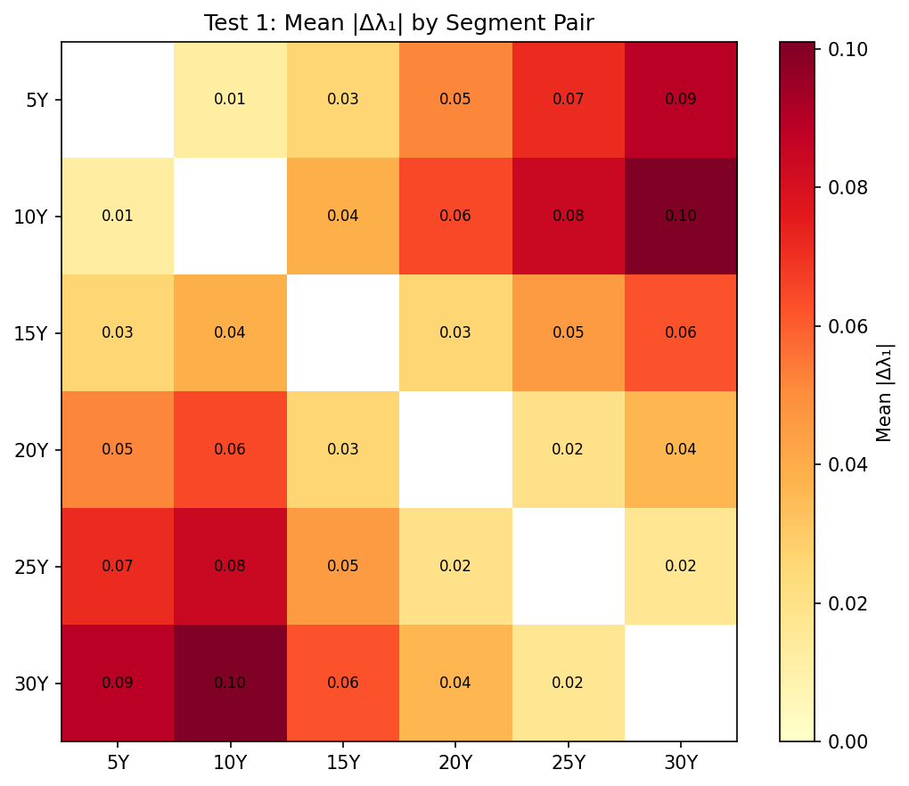
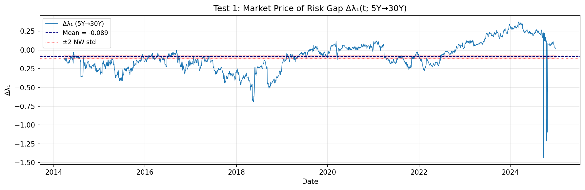
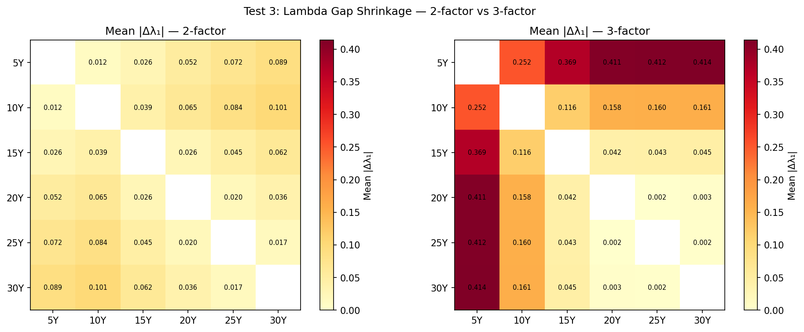
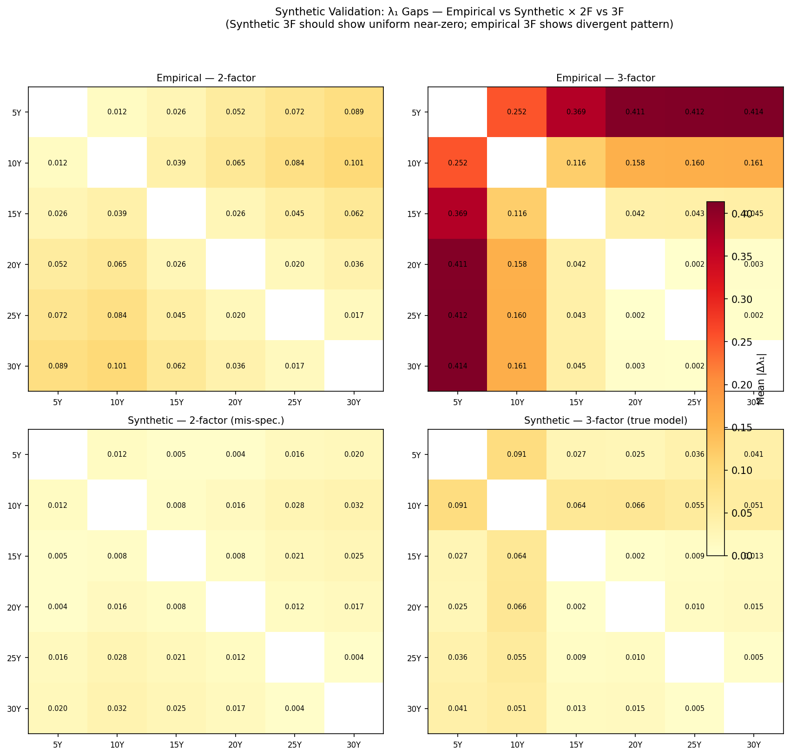

# Abstract

The standard no-arbitrage framework for bond markets assumes a
tradable bank account $B$ as universal numéraire. But $B$ is not
directly traded — it must be synthesized from zero-coupon bonds via a
rolling strategy that, in continuous time, requires continuous
rebalancing rather than a finite sequence of trades. Practitioners
meanwhile price with T-forward measures $Q^T$, each anchored by a
single tradable bond, and never invoke $B$.

We ask whether the family $\{Q^T\}$, built from tradable bonds alone,
assembles into a single risk-neutral measure $Q$ — or whether $Q$ is
an additional assumption. The answer splits. In discrete time, in any
arbitrage-free model a consistent family exists and the bank account
emerges as a self-financing rolling strategy, yielding a four-way
FTAP equivalence. In continuous time, we give a precise $Q$-free
definition of forward-measure consistency, prove that a global
measure then always exists — the family glues constructively to the
terminal bond as numéraire, with consistency against the terminal
maturity alone sufficing — and show that the remaining content of the
title question is the existence of an implied savings account: a
predictable numéraire of finite variation inducing the given family.
By a theorem of Döberlein and Schweizer, this reduces to a
decomposition property (goodness) of the terminal bond; whether bare
consistency forces that property is, to our knowledge, open, and we
isolate its three separable failure channels.

A descriptive exercise on EUR government curves (independent
segment-wise Gaussian-HJM calibration) finds systematically
incompatible market prices of risk across maturity segments, in a
divergent pattern that the synthetic controls we examined do not
replicate — consistent with absence of a single $Q$, with inadequacy
of the model class used, or with artefacts of the model-fitted input
curves, but establishing that the question has empirical content.

# 1. Introduction

## 1.1 The Question

The foundational insight of Black and Scholes (1973) and Merton (1973)
is that derivative prices are determined by replication using tradable
assets. The risk-neutral measure $Q$, introduced by Harrison and Kreps
(1979), encodes this replication logic mathematically (for a
comprehensive treatment, see Bingham and Kiesel 2004).

In bond markets, the tradable assets are zero-coupon bonds
$p(\cdot,T)$. The bank account
$B(t) = \exp\left( \int_{0}^{t} r(s) \, ds \right)$ — the standard
numéraire of the FTAP — is not directly traded. To construct it, one
must execute a rolling strategy: hold the just-maturing bond, roll
the proceeds into the next. In discrete time, this is a finite,
self-financing strategy using traded bonds. In continuous time, it
requires continuous rebalancing through an uncountable family of
maturities — and the convergence of this strategy is not guaranteed
by the well-behavedness of individual bond prices.

Practitioners already work without $B$: to price a caplet at $T$,
they use the T-bond as numéraire and $Q^T$ as pricing measure. Each
operation is faithful to the Black-Scholes-Merton logic — replicate
using tradable instruments, extract the price. This paper takes the
practitioners' approach seriously and asks:

> *Does the family $\{Q^T\}$ of local pricing measures, derived from
> tradable bonds, necessarily cohere into a single global measure $Q$?*

If yes, the bank account is a derived object — it emerges from the
consistency of local pricing, and the standard FTAP is confirmed from
the bottom up. If no, the standard theory requires an assumption
(the existence of $Q$ and $B$) that goes beyond what tradable
instruments can deliver.

In discrete time, we show the answer is yes: absent arbitrage, a
consistent family exists and $B$ is constructible (Section 2). In
continuous time, we prove that a global measure always exists — the
family glues to the terminal bond as numéraire (Proposition 3.3.1) —
and reduce the remaining question, via Döberlein and Schweizer
(2001), to whether consistency forces a decomposition property of
the terminal bond; this we leave open (Section 3). We then present a
descriptive empirical exercise showing the question has empirical
content (Section 4).

To be clear about what is and is not established: we contribute (i) a
precise, $Q$-free definition of forward-measure consistency
(Definition 3.2.1), under which the pairwise conditions provably
self-propagate (Lemma 2.4.1), with bond-ratio bubbles excluded by
hypothesis; (ii) a constructive existence theorem (Proposition
3.3.1): under the definition a global measure and numéraire always
exist — the terminal bond glues the family — with consistency against
the terminal maturity alone implying full consistency (Corollary
3.3.2); (iii) an exact reduction (Proposition 3.3.3): an implied
savings account inducing the family exists if and only if the
terminal generating pair is *good* in the sense of Döberlein and
Schweizer (2001) — so the residual open question is precisely whether
consistency implies goodness, with three separable failure channels
(Sections 3.3–3.4); and (iv) a descriptive demonstration that the
question has empirical content (Section 4). The existence mechanism
behind the reduction is Döberlein and Schweizer's, not ours; we do
not resolve whether consistency implies goodness, and we do not claim
a relationship to existing large-market results beyond a precise
statement of the residual gap (Section 5).

## 1.2 Related Work

Musiela and Rutkowski (1997) and Döberlein, Schweizer, and Stricker
(2000) proved uniqueness of the implied savings account — but took
existence as given. Our question is the complement: existence given
local data. Proposition 3.3.1 makes the complement exact — a global
measure with a bond numéraire always exists — and Döberlein and
Schweizer (2001) supply the existence mechanism for the savings
account itself: it exists precisely when a generating pair is *good*
(their Theorem 5, via the multiplicative decomposition of
semimartingales). What remains, and what we pose, is whether bare
consistency of the family forces goodness of the terminal pair
(Proposition 3.3.3, Section 3.4).

The closest existing work is Klein, Schmidt, and Teichmann (2016),
who investigate bond markets where "the bank account process is not
a valid numéraire or does not exist at all." They argue this is "not
the exception but rather the rule" when starting from terminal bonds
as numéraires. Using large financial market methods, they prove that
no asymptotic free lunch (NAFL) is equivalent to the existence of an
equivalent local martingale measure with respect to a terminal bond,
and they construct a generalized bank account as a limit of convex
combinations of roll-over bonds. Their work establishes the
theoretical framework for bond markets without a classical bank
account. Our question starts from a different point — pairwise
measure consistency (Definition 3.2.1) rather than a no-arbitrage
condition on trading strategies — and the relationship between these
two starting points is, to our knowledge, not established.
Klein-Schmidt-Teichmann's generalized bank account is a limit object
that may differ from the classical $B$; whether pairwise consistency
of $\{Q^T\}$ implies NAFL (or vice versa) is an open question that
connects our work to theirs; Section 5 states the residual gap
precisely.

Herdegen (2017) develops a numéraire-independent FTAP for general
markets. Whether his condition $\text{NA}^{\text{ni}}$ coincides
with, is weaker than, or is stronger than our Bond-Family condition
(BF) in continuous-time bond markets is, to our knowledge, open.

A continuous-time bond market with a continuum of maturities is a
large financial market in the sense of Cuchiero, Klein, and Teichmann
(2016), De Donno (2004), Takaoka and Schweizer (2014), and Carmona
and Tehranchi (2006). Our question — does $\{Q^T\}$ cohere into a
single $Q$? — is related to the existence of an equivalent martingale
measure in such markets. We note the connection but do not pursue it
formally; the bond-specific structure may give the question a
different character from the general large-market problem, though we
cannot establish this precisely.

Filipović (2001, 2009) studies consistency problems for HJM models —
when HJM dynamics preserve the shape of the yield curve within a
given parametric family. This is a related but distinct question:
Filipović asks whether a model is internally consistent with a family
of initial curves, while we ask whether independently calibrated
local measures are mutually consistent. The tools developed in
Filipović's framework (function spaces, regularity conditions) may
be relevant to resolving our question, but we do not establish the
connection formally.

Henrard (2007) and Morini (2009) identified the post-2007 failure of
single-curve pricing. The multi-curve literature (Filipović and Trolle
2013, Crépey et al. 2015, Grbac and Runggaldier 2015) addresses a
different mechanism — counterparty credit risk in interbank rates —
but the conceptual parallel is suggestive: the single-curve assumption
is the assumption that $\{Q^T\}$ coheres.

In retrospect, our question belongs to what has been called the
bottom-up or model-free tradition in mathematical finance: Samuelson
(1938) asked whether observed choices imply preferences exist; Hobson
(1998) and the model-free finance programme (Davis and Hobson 2007,
Acciaio et al. 2013) ask what can be inferred from observed prices
without assuming a model; Balbás, Ibáñez, and López (2002) use
projective limits of measure families to characterize no-arbitrage
over infinite horizons. We recognized this connection during the
development of the paper, not at the outset.

## 1.3 Structure

Section 2 establishes the proof of concept: in discrete time, a
consistent family of forward measures always exists and glues into a
global $(Q, B)$. Section 3 formalizes the continuous-time question
and locates the obstruction in the numéraire. Section 4 presents a
descriptive empirical exercise demonstrating the question has
empirical content. Section 5 identifies directions for future
investigation.

# 2. Discrete Time: Proof of Concept

## 2.1 Setup

Let $(\Omega, \mathcal{F}, (\mathcal{F}_t)_{t=0,\ldots,N}, \mathbb{P})$
be a filtered probability space. The market consists of default-free
zero-coupon bonds $p(t,T)$ with $p(T,T) = 1$ and $p(t,T) > 0$, plus
risky assets $X^1,\ldots,X^d$. No bank account is assumed.

A trading strategy is a predictable process specifying holdings in
each asset. It is self-financing if portfolio value changes arise
solely from price movements. An arbitrage is a zero-cost
self-financing strategy producing $V_N \geq 0$ a.s. with
$\mathbb{P}(V_N > 0) > 0$.

## 2.2 The Rolling Bond Strategy

**Proposition 2.2.1.** Define $B(0) := 1$ and
$B(t) := \prod_{s=1}^{t} 1/p(s-1,s)$. Then $B$ is the value process
of a self-financing strategy holding, during each period $(t-1,t]$,
exactly $B(t-1)/p(t-1,t)$ units of the just-maturing bond
$p(\cdot,t)$. The one-period return $1/p(t-1,t)$ is deterministic
given $\mathcal{F}_{t-1}$.

## 2.3 The Four Equivalences

**Proposition 2.3.1 (Bond-Based FTAP, Discrete Time).** The following
are equivalent:

**(NA)** No arbitrage exists in the bond market.

**(EMM)** $\exists Q \sim P$ such that $S(t)/B(t)$ is a $Q$-martingale
for all traded assets $S$.

**(RF)** $\exists Q \sim P$ such that
$E^Q[R_t^S \mid \mathcal{F}_{t-1}]$ equals the just-maturing bond
return $[1 - p(t-1,t)]/p(t-1,t)$ for all traded $S$, where
$R_t^S := S(t)/S(t-1) - 1$ is the one-period simple return.

**(BF)** For each $T \in \{1,\ldots,N\}$, $\exists Q^T \sim P$ such
that $S(t)/p(t,T)$ is a $Q^T$-martingale for all traded assets $S$
and $t \le T$.

Moreover, the forward measures constructed in the proof of
$(\text{EMM}) \Rightarrow (\text{BF})$ satisfy the consistency relation

$$\frac{dQ^{T_1}}{dQ^{T_2}}\bigg|_{\mathcal{F}_{T_1}} = \frac{p(0,T_2)}{p(0,T_1) \cdot p(T_1,T_2)}   \quad (2.1)$$

involving only bond prices, with no reference to $B$.

*Proof sketch.* $(\text{NA}) \iff (\text{EMM})$: Rolling construction
makes $B$ tradable; Harrison-Pliska (1981) applies.
$(\text{EMM}) \iff (\text{RF})$: Algebraic reformulation — the
equivalence follows from multiplying both sides of the martingale
condition by $B(t-1)/S(t-1)$ and using $B(t)/B(t-1) = 1/p(t-1,t)$.
$(\text{EMM}) \Rightarrow (\text{BF})$: Bayes' formula with density
$Z^T_t := p(t,T)/[B(t) \cdot p(0,T)]$.
$(\text{BF}) \Rightarrow (\text{NA})$: Under $Q^N$,
$V^\varphi_t/p(t,N)$ is a martingale; $V_0 = 0$ forces $V_N = 0$
a.s. Full proofs in Appendix A. $\quad\square$

**Remark.** The proposition assembles standard ingredients
(Harrison-Pliska for $(\text{NA}) \iff (\text{EMM})$, Bayes' formula
for the numéraire change, Geman-El Karoui-Rochet 1995 for the
general framework). Its purpose here is not mathematical novelty but
to establish the four-way equivalence and to identify the precise
point where the argument uses discreteness: the chain rule across
maturity triples is a finite number of conditions. This is the point
that becomes problematic in continuous time.

## 2.4 A Consistent Family Always Exists — But Only in Discrete Time

Given (EMM), the family $\{Q^T\}$ constructed via
$Z^T_t = p(t,T)/[B(t) \cdot p(0,T)]$ satisfies (2.1), and the chain rule
$$\frac{dQ^{T_1}}{dQ^{T_3}} = \frac{dQ^{T_1}}{dQ^{T_2}} \cdot \frac{dQ^{T_2}}{dQ^{T_3}}$$
across maturity triples is a finite number of conditions, each
satisfied by construction. In an incomplete market other
forward-measure selections exist; (2.1) singles out the mutually
compatible family.

The discreteness that does the work here is discreteness of *trading*:
$B$ is a finite product of one-period bond returns. With finitely many
maturities but continuous trading, $B$ still need not exist for all
$t$ (Section 3.4). That a consistent family glues into a global
$(Q, B)$ is, under discrete trading, a consequence of finitude, not of
structure.

**Lemma 2.4.1 (Pairwise consistency is self-propagating).** *Under
the true-martingale hypothesis of Definition 3.2.1, if a family
$\{Q^T\}$ satisfies (3.1) for every pair, it satisfies the triple
relation automatically: for $T_1 < T_2 < T_3$,*
$$\frac{dQ^{T_1}}{dQ^{T_3}}\bigg|_{\mathcal{F}_{T_1}} = \frac{dQ^{T_1}}{dQ^{T_2}}\bigg|_{\mathcal{F}_{T_1}} \cdot \frac{dQ^{T_2}}{dQ^{T_3}}\bigg|_{\mathcal{F}_{T_1}}.$$

*Proof.* By the true-martingale hypothesis, the bond ratio
$p(\cdot,T_2)/p(\cdot,T_3)$ is a true $Q^{T_3}$-martingale on $[0,T_2]$,
so optional sampling at $t = T_1$ is valid and (3.1) for the pair
$(T_2, T_3)$ gives
$\frac{dQ^{T_2}}{dQ^{T_3}}\big|_{\mathcal{F}_{T_1}}
= \frac{p(0,T_3)}{p(0,T_2)} \cdot \frac{p(T_1,T_2)}{p(T_1,T_3)}$.
Multiplying by (3.1) for $(T_1, T_2)$ and cancelling $p(T_1,T_2)$ and
$p(0,T_2)$ returns (3.1) for $(T_1, T_3)$. $\square$

The cocycle is therefore not an additional requirement: pairwise
consistency is never the source of failure. Whatever obstructs the
passage to a global $Q$ in continuous time, it is not incompatibility
of the measure family at any finite level.

**Remark (Relationship to Herdegen 2017).** In bond markets with
strictly positive prices, Herdegen's numéraire-independent
no-arbitrage ($\text{NA}^{\text{ni}}$) coincides with NA in discrete
time: with finitely many assets all having strictly positive prices,
any numéraire is equivalent to any other, and the no-arbitrage
conditions coincide (Herdegen 2017). Our Bond-Family
formulation (BF) is the only condition among the four equivalences
that extends to continuous time without assuming $B$. Whether (BF)
in continuous time is equivalent to, weaker than, or stronger than
$\text{NA}^{\text{ni}}$ restricted to bond markets is an open
question.

# 3. Continuous Time: The Question

## 3.1 Where the Proof Breaks

In continuous time, the rolling strategy requires trading at every
instant through uncountably many bonds (cf. Björk et al. 1997,
Döberlein and Schweizer 2001). The Bond-Family condition survives —
each $Q^T$ uses only the tradable T-bond — but consistency over a
continuum of maturities is no longer automatic.

## 3.2 Forward-Measure Consistency

We define the key concept without presupposing $Q$ or $B$.

**Definition 3.2.1 (Forward-Measure Consistency).** Let
$\{Q^T\}_{T \in \mathcal{T}}$ be a family of probability measures on
$(\Omega, \mathcal{F})$, each equivalent to $\mathbb{P}$, indexed by a
set of maturities $\mathcal{T} \subseteq [0, T^*]$. Assume that for
each $T$, $S(t)/p(t,T)$ is a $Q^T$-local martingale on $[0,T]$ for
all traded assets $S$, including bonds of all maturities (the
forward martingale property; for a bond $p(\cdot,T')$ with $T' < T$,
the requirement is on $[0, T' \wedge T]$), and that for each pair $T_1 < T_2$ the
bond ratio $p(\cdot,T_1)/p(\cdot,T_2)$ is a *true* $Q^{T_2}$-martingale
on $[0,T_1]$ — equivalently, no bond-ratio bubble arises up to the
shorter maturity. The family is *consistent* if for all
$T_1 < T_2$ in $\mathcal{T}$:

$$\frac{dQ^{T_1}}{dQ^{T_2}}\bigg|_{\mathcal{F}_{T_1}} = \frac{p(0,T_2)}{p(0,T_1) \cdot p(T_1,T_2)}.   \quad (3.1)$$

A remark on the status of (3.1). It is a genuine condition, not a
consequence of the bare forward martingale property. Under $Q^{T_2}$,
the change of numéraire from the $T_2$-bond to the $T_1$-bond produces
*a* measure with density (3.1) — a valid $T_1$-forward measure. But in
an incomplete market forward measures are not unique, and the family
member $Q^{T_1}$ need not coincide with this numéraire-change image.
Consistency is precisely the requirement that the family's selections
are mutually compatible. Note that the true-martingale clause in the
definition's standing assumption is exactly what makes the right-hand
side of (3.1) a bona fide Radon-Nikodym density: for the pair
$(T_1,T_2)$ the bond ratio $p(\cdot,T_1)/p(\cdot,T_2)$ is a non-negative
$Q^{T_2}$-local martingale with terminal value $1/p(T_1,T_2)$, hence a
supermartingale, and its expectation equals $p(0,T_1)/p(0,T_2)$ — so
(3.1) integrates to one — if and only if it is a true martingale rather
than a strict local one. A strict local martingale (a bond-ratio
bubble) would make the right-hand side integrate to less than one. The
definition therefore *presupposes* the absence of bond-ratio bubbles up
to each shorter maturity; it does not derive it. (On strict-local-
martingale bubbles and their characterisation via change of numéraire,
see Cox and Hobson 2005, Jarrow, Protter, and Shimbo 2010, and Protter
2013.)

**Remark.** When $\mathcal{T}$ is finite, condition (3.1) suffices:
Proposition 2.3.1 constructs $Q$ and $B$ from the family. By Lemma
2.4.1 the pairwise conditions are mutually compatible at every finite
level even when $\mathcal{T}$ is a continuum — and in fact a global
$Q$ faces no obstruction at all: Proposition 3.3.1 below constructs a
pair $(Q, B)$ explicitly, with the terminal bond as numéraire. What a
global risk-neutral measure requires beyond the family is a
*numéraire process* $B$ — a single $Q \sim \mathbb{P}$ and a strictly
positive adapted $B$ with
$\frac{dQ^T}{dQ}\big|_{\mathcal{F}_t} = \frac{p(t,T)}{B(t) p(0,T)}$
for every $T$ — and such a pair always exists. What the construction
does not, and cannot, deliver is a numéraire that is *locally
riskless*. Whether one exists reduces to a decomposition property of
the terminal bond (Sections 3.3–3.4).

**Why standard extension theorems do not immediately apply.** A
natural reaction is that the Kolmogorov extension theorem (or its
measure-theoretic variants) should resolve the question: given a
consistent family of finite-dimensional distributions, the theorem
constructs a measure on the projective limit. However, the pairwise
consistency condition (3.1) is not of Kolmogorov type. Kolmogorov
consistency relates measures on *nested sub-σ-algebras* via
restriction: $\mu_{n+1}|_{\mathcal{F}_n} = \mu_n$. Our condition
(3.1) relates measures on the *same* σ-algebra $\mathcal{F}$ via
Radon-Nikodym derivatives determined by bond prices. These are
structurally different: (3.1) specifies how the measures *reweight*
each other, not how they *restrict*. The passage from pairwise reweighting to a global measure turns out
to require no extension machinery at all: Proposition 3.3.1
constructs $(Q, B)$ directly from the terminal bond. What no gluing
argument supplies is the *savings-account property* of the numéraire
— the genuinely open content (Section 3.3).

## 3.3 The Question — Posed, Answered, and Re-Posed

A first formalization of the question of this paper reads:

> *Given a family $\{Q^T\}_{T \in [0,T^*]}$ satisfying Definition
> 3.2.1, does there exist a probability measure $Q \sim \mathbb{P}$
> and a strictly positive adapted process $B$ such that $S(t)/B(t)$
> is a $Q$-local martingale for all traded assets, each deflated bond
> $p(\cdot,T)/B$ is a *true* $Q$-martingale, and each $Q^T$ coincides
> on $\mathcal{F}_T$ with the T-forward measure induced by $Q$?*

The answer, it turns out, is yes — always, and constructively. For
$T \le T^*$ write
$$\Lambda^T_t := \frac{d\big(Q^{T}\big|_{\mathcal{F}_t}\big)}{d\big(Q^{T^*}\big|_{\mathcal{F}_t}\big)},
\qquad t \in [0, T^*],$$
the density process of $Q^T$ with respect to $Q^{T^*}$: a strictly
positive $Q^{T^*}$-martingale, with
$\Lambda^T_s = E^{Q^{T^*}}[\Lambda^T_t \mid \mathcal{F}_s]$ for
$s \le t$ by the tower property.

**Proposition 3.3.1 (Terminal-bond gluing).** *Assume Definition
3.2.1 — in fact only the forward martingale property for $T = T^*$
and the true-martingale and consistency conditions for the pairs
$(T, T^*)$, $T \in [0,T^*]$, are used. Define*
$$Q := Q^{T^*}, \qquad B(t) := \frac{p(t, T^*)}{p(0, T^*)},
\qquad t \in [0, T^*].$$
*Then:*

*(a) $B$ is strictly positive, adapted, $B(0) = 1$, and is the value
process of the static self-financing strategy holding $1/p(0,T^*)$
units of the $T^*$-bond.*

*(b) For every traded asset $S$, the deflated process $S/B$ is a
$Q$-local martingale (on $[0, T']$ for a bond of maturity $T'$).*

*(c) For every $T \in [0,T^*]$, $p(\cdot,T)/B$ is a* true
*$Q$-martingale on $[0,T]$.*

*(d) For every $T \in [0,T^*]$ and every $t \in [0,T]$,*
$$\frac{dQ^{T}}{dQ}\Big|_{\mathcal{F}_t}
= \frac{p(t,T)}{B(t)\, p(0,T)};$$
*that is, $Q^T$ coincides on $\mathcal{F}_T$ with the $T$-forward
measure induced by $(Q, B)$, and this induced measure is well
defined.*

*Proof.* Fix $T \in [0,T^*]$ and write $M_t := p(t,T)/p(t,T^*)$ for
$t \in [0,T]$.

*Step 1 (density-process identity).* By (3.1) for the pair
$(T, T^*)$,
$$\Lambda^T_{T} = \frac{p(0,T^*)}{p(0,T)\, p(T, T^*)},$$
which is non-negative with
$E^{Q^{T^*}}[\Lambda^T_T] = Q^T(\Omega) = 1$, hence integrable. For
$t \le T$, the tower property of the density martingale gives
$$\Lambda^T_t
= E^{Q^{T^*}}\!\big[\Lambda^T_{T} \,\big|\, \mathcal{F}_t\big]
= \frac{p(0,T^*)}{p(0,T)}\;
  E^{Q^{T^*}}\!\Big[\frac{1}{p(T,T^*)} \,\Big|\, \mathcal{F}_t\Big].$$
By the true-martingale hypothesis for the pair $(T, T^*)$, $M$ is a
true $Q^{T^*}$-martingale on $[0,T]$ with terminal value
$M_T = 1/p(T,T^*)$; hence
$E^{Q^{T^*}}[1/p(T,T^*) \mid \mathcal{F}_t] = M_t$ and
$$\Lambda^T_t
= \frac{p(0,T^*)}{p(0,T)} \cdot \frac{p(t,T)}{p(t,T^*)},
\qquad t \in [0, T]. \tag{3.2}$$
(At $t = 0$ the right-hand side equals $1$; in particular all $Q^T$
coincide on $\mathcal{F}_0$.)

*Step 2 (claim (a)).* Immediate: $p(\cdot,T^*) > 0$ is adapted,
$B(0) = 1$, and a constant holding of one asset is self-financing.

*Step 3 (claim (b)).* Since $Q = Q^{T^*}$ and
$S/B = p(0,T^*)\,\big(S / p(\cdot,T^*)\big)$, claim (b) is the
forward martingale property for $T = T^*$ multiplied by the constant
$p(0,T^*)$. No change of measure is involved.

*Step 4 (claim (c)).* $p(\cdot,T)/B = p(0,T^*)\, M$, a true
$Q^{T^*}$-martingale on $[0,T]$ by the true-martingale hypothesis
for $(T,T^*)$. For $T = T^*$ the process is the constant
$p(0,T^*)$.

*Step 5 (claim (d)).* The $T$-forward measure induced by $(Q,B)$ is
defined, when the deflated bond is a true martingale, by the density
process
$$Z^T_t := \frac{p(t,T)/B(t)}{p(0,T)/B(0)}
= \frac{p(t,T)}{B(t)\,p(0,T)}
= \frac{p(0,T^*)}{p(0,T)} \cdot \frac{p(t,T)}{p(t,T^*)},
\qquad t \in [0,T],$$
using $B(0) = 1$. By Step 4, $Z^T$ is a strictly positive true
$Q$-martingale with $Z^T_0 = 1$, so the induced measure is a
well-defined probability measure on $\mathcal{F}_T$. Comparing with
(3.2), $\Lambda^T_t = Z^T_t$ for all $t \in [0,T]$; hence $Q^T$
coincides with the induced measure on $\mathcal{F}_T$. $\square$

The construction has a strong converse-style companion: consistency
against the terminal maturity alone already implies the full
definition.

**Corollary 3.3.2 (Against-terminal consistency suffices).** *Assume
the forward martingale property for $T = T^*$ and the true-martingale
and consistency conditions only for the pairs $(T, T^*)$,
$T \in [0,T^*]$. Then the true-martingale and consistency conditions
hold for* all *pairs $T_1 < T_2$; that is, Definition 3.2.1 holds in
full.*

*Proof.* Fix $T_1 < T_2 \le T^*$. For consistency: all three measures
are mutually equivalent, so on $\mathcal{F}_{T_1}$ the chain rule for
Radon-Nikodym derivatives gives, a.s.,
$$\frac{dQ^{T_1}}{dQ^{T_2}}\Big|_{\mathcal{F}_{T_1}}
= \frac{\Lambda^{T_1}_{T_1}}{\Lambda^{T_2}_{T_1}}
= \frac{\dfrac{p(0,T^*)}{p(0,T_1)\,p(T_1,T^*)}}
       {\dfrac{p(0,T^*)\,p(T_1,T_2)}{p(0,T_2)\,p(T_1,T^*)}}
= \frac{p(0,T_2)}{p(0,T_1)\, p(T_1,T_2)},$$
where both density values come from (3.2) (for $T = T_1$ and
$T = T_2$, evaluated at $t = T_1$), which uses only against-terminal
hypotheses. For the true-martingale condition: let
$s \le t \le T_1$ and $X := p(t,T_1)/p(t,T_2) \ge 0$. The abstract
Bayes formula for the change $Q^{T_2} \leftrightarrow Q^{T^*}$
(valid for non-negative integrands) gives
$$E^{Q^{T_2}}\!\big[X \mid \mathcal{F}_s\big]
= \frac{E^{Q^{T^*}}\!\big[\Lambda^{T_2}_t\, X \mid \mathcal{F}_s\big]}
       {\Lambda^{T_2}_s}
= \frac{E^{Q^{T^*}}\!\Big[\dfrac{p(t,T_1)}{p(t,T^*)} \,\Big|\,
   \mathcal{F}_s\Big]}{\dfrac{p(s,T_2)}{p(s,T^*)}}
= \frac{p(s,T_1)/p(s,T^*)}{p(s,T_2)/p(s,T^*)}
= \frac{p(s,T_1)}{p(s,T_2)},$$
using (3.2) for $T_2$ in the second equality and the true-martingale
hypothesis for $(T_1,T^*)$ in the third. Taking $s = 0$ yields
integrability:
$E^{Q^{T_2}}[\,p(t,T_1)/p(t,T_2)\,] = p(0,T_1)/p(0,T_2) < \infty$.
$\square$

**What the proposition does and does not deliver.** The numéraire
exhibited is tradable by a static buy-and-hold strategy — but it is
*not locally riskless*: $B$ carries the full price risk of the
terminal bond. The proposition therefore resolves the
*measure-existence* half of the question unconditionally. What it
deliberately does not deliver is a *savings account*: a numéraire
that is predictable and of finite variation (in the absolutely
continuous case $B(t) = \exp\!\int_0^t r(s)\,ds$ for a short rate
$r$; in discrete time, a predictable process, as the rolling account
of Proposition 2.2.1 is). This locally-riskless property is what
distinguishes a bank account from a bond — and it is precisely the
clause the first formalization above omits. The question of this
paper, correctly posed, is therefore:

> *Given a family $\{Q^T\}_{T \in [0,T^*]}$ satisfying Definition
> 3.2.1, does there exist an* implied savings account *for the
> family: a probability measure $Q \sim \mathbb{P}$ and a strictly
> positive predictable process $B$ of finite variation with
> $B(0) = 1$, such that $p(t,T) = E^{Q}[\,B(t)/B(T) \mid
> \mathcal{F}_t\,]$ for all $t \le T \le T^*$ and each $Q^T$
> coincides on $\mathcal{F}_T$ with the $T$-forward measure induced
> by $(Q, B)$?*

The object in the box is exactly the implied savings account of
Musiela and Rutkowski (1997) and Döberlein, Schweizer, and Stricker
(2000) — who proved that such a $B$, when it exists, is unique — with
one addition: we require it to induce *the given family*, not merely
to reproduce the bond prices. Döberlein and Schweizer (2001) supply
the existence mechanism. Call a pair $(R, L)$ — $R \sim \mathbb{P}$,
$L$ a strictly positive semimartingale with $L_0 = 1$, $L_- > 0$ —
*good* if $L$ is a special $R$-semimartingale whose multiplicative
decomposition $L = M C$ (with $M$ a local $R$-martingale, $C$
predictable of finite variation; Jacod 1979) has $M$ a *true*
$R$-martingale. Their Theorem 5 shows that a good generating pair
yields an implied savings account, $B = 1/C$. In our setting the
natural generating pair is pinned by the family itself:

**Proposition 3.3.3 (Reduction to goodness).** *Let $\{Q^T\}$
satisfy Definition 3.2.1 and set*
$$G_t := \frac{p(0, T^*)}{p(t, T^*)}, \qquad t \in [0, T^*].$$
*Then $(Q^{T^*}, G)$ is a generating pair for the bond prices, i.e.
$p(t,T) = E^{Q^{T^*}}[\,G_T/G_t \mid \mathcal{F}_t\,]$, and the
following are equivalent:*

*(i) an implied savings account for the family exists (the boxed
question above);*

*(ii) the pair $(Q^{T^*}, G)$ is good.*

*In that case $B = 1/C$ and
$\frac{dQ}{dQ^{T^*}}\big|_{\mathcal{F}_t} = M_t$, where $G = MC$ is
the multiplicative decomposition.*

*Proof.* That $(Q^{T^*}, G)$ generates the prices is identity (3.2)
rearranged:
$E^{Q^{T^*}}[G_T/G_t \mid \mathcal{F}_t]
= p(t,T^*)\, E^{Q^{T^*}}[1/p(T,T^*) \mid \mathcal{F}_t] = p(t,T)$ by
the true-martingale hypothesis.

*(ii) $\Rightarrow$ (i).* Let $G = MC$ be the multiplicative
decomposition with $M$ a true $Q^{T^*}$-martingale, and define $Q$ by
$\frac{dQ}{dQ^{T^*}}\big|_{\mathcal{F}_t} := M_t$ and $B := 1/C$,
predictable of finite variation with $B(0) = 1$. Bayes' rule gives
$$p(t,T) = E^{Q^{T^*}}\!\Big[\frac{M_T C_T}{M_t C_t}
\,\Big|\, \mathcal{F}_t\Big]
= E^{Q}\!\Big[\frac{C_T}{C_t} \,\Big|\, \mathcal{F}_t\Big]
= E^{Q}\!\Big[\frac{B(t)}{B(T)} \,\Big|\, \mathcal{F}_t\Big],$$
so $p(t,T)/B(t) = E^Q[1/B(T) \mid \mathcal{F}_t]$ is a true
$Q$-martingale on $[0,T]$. The induced $T$-forward density against
$Q^{T^*}$ is
$$\frac{d\tilde Q^T}{dQ^{T^*}}\Big|_{\mathcal{F}_t}
= M_t \cdot \frac{p(t,T)}{B(t)\, p(0,T)}
= \frac{G_t\, p(t,T)}{p(0,T)}
= \frac{p(0,T^*)\, p(t,T)}{p(0,T)\, p(t,T^*)}
= \Lambda^T_t$$
by (3.2), so $\tilde Q^T = Q^T$ on $\mathcal{F}_T$ for every $T$: the
account induces the given family. Finally, for any traded asset $S$,
$(S/B)\, M = S\, G / p(0,T^*) \cdot p(0,T^*) = p(0,T^*)\,
S/p(\cdot,T^*)$ up to the constant, a $Q^{T^*}$-local martingale by
the forward martingale property at $T^*$; by Bayes, $S/B$ is a
$Q$-local martingale.

*(i) $\Rightarrow$ (ii).* Coincidence at $T = T^*$ gives
$\frac{dQ^{T^*}}{dQ}\big|_{\mathcal{F}_t}
= \frac{p(t,T^*)}{B(t)\, p(0,T^*)} = \frac{1}{B(t)\, G_t}$, so
$M_t := \frac{dQ}{dQ^{T^*}}\big|_{\mathcal{F}_t} = B(t)\, G_t$ is a
strictly positive true $Q^{T^*}$-martingale. Hence
$G = M \cdot (1/B)$ with $1/B$ predictable of finite variation: $G$
is a special $Q^{T^*}$-semimartingale and, by uniqueness of the
multiplicative decomposition, $(M, 1/B)$ *is* that decomposition, so
$(Q^{T^*}, G)$ is good. $\square$

Two remarks. First, the construction of Proposition 3.3.1 uses the
existence of a longest bond $T^* \in \mathcal{T}$; on an unbounded
maturity set no terminal bond is available and the numéraire must be
produced as a limit — precisely the roll-over convex-combination
territory of Klein, Schmidt, and Teichmann (2016). Second, the pair
$(Q,B)$ inducing a given consistent family is far from unique: any
strictly positive adapted $\hat B$ with $\hat B(0) = 1$ and
$\hat B / p(\cdot, T^*)$ a true $Q^{T^*}$-martingale induces the same
family. Proposition 3.3.1 exhibits the canonical tradable choice;
the savings-account pair, when it exists, is the canonical locally
riskless one — and by the uniqueness theorem of Döberlein, Schweizer,
and Stricker (2000) it is then the only one.

We note the relation to the HJM drift condition. In the HJM
framework driven by finite-dimensional Brownian motion, the savings
account is the exponential of the short rate, and the generating pair
$(Q, 1/\beta)$ is good by construction under the drift condition
$\alpha(t,T) = \sigma(t,T) \cdot \int_t^T \sigma(t,s) \, ds$
(cf. Döberlein and Schweizer 2001, Example 3, for the Gaussian case):
the "if" direction — the drift condition delivers the savings-account
pair — is textbook (Heath, Jarrow, and Morton 1992). Whether
consistency of the family *forces* such a structure — the "only if"
direction — is the open problem in this parametric setting. The
restriction to finite-dimensional driving noise is substantive; under
infinite-dimensional noise (cylindrical Brownian motion), the
question may take a different form.

## 3.4 The Residual Gap: Does Consistency Imply Goodness?

By Propositions 3.3.1 and 3.3.3, the open question of this paper has
been reduced to a single, sharply localized property: given a family
satisfying Definition 3.2.1, is the terminal pair $(Q^{T^*}, G)$,
$G = p(0,T^*)/p(\cdot,T^*)$, necessarily *good*? Goodness can fail in
exactly three separable ways, and each is a distinct hunting ground
for a counterexample:

$(\alpha)$ $G$ fails to be a semimartingale under $Q^{T^*}$;
$(\beta)$ $G$ is a semimartingale but not special;
$(\gamma)$ $G$ is special, but the local-martingale factor $M$ in its
multiplicative decomposition $G = MC$ is a strict local martingale —
a bubble in the martingale part of the terminal bond.

A consistent family realizing any one of $(\alpha)$–$(\gamma)$ would
settle the question negatively; a proof that Definition 3.2.1
excludes all three would settle it affirmatively. Nothing in the
definition visibly forces any of them: the axioms constrain
*ratios* of bond prices under the family members, not the terminal
bond level itself.

The structure of the gap is best seen through a diagonal. For each
maturity $u \in [0,T^*]$ set $M^{(u)}_s := p(s,u)/p(s,T^*)$,
$s \in [0,u]$ — by Definition 3.2.1 each of these is a *true*
$Q^{T^*}$-martingale. Since $p(t,t) = 1$,
$$G_t = p(0,T^*)\, M^{(t)}_t:$$
the generator is, up to a constant, the *diagonal* of the martingale
field $\{M^{(u)}\}$. Consistency controls every *column*
$s \mapsto M^{(u)}_s$ of the field; goodness constrains the
*diagonal* $t \mapsto M^{(t)}_t$. Column-wise regularity does not, in
general, transfer to a diagonal, and this is the precise form of the
regularity gap we could earlier describe only by analogy with trace
problems — with the notable difference that it sits in the *time*
direction, not the maturity direction. The rolling construction of
Proposition 2.2.1 is the discrete-time shadow of the same object: it
walks the diagonal one period at a time, and predictability of each
step is what makes the discrete account locally riskless.

Two structural facts calibrate the difficulty. First, if the family
has nonnegative rates in the monotonicity sense
$p(t,S) \ge p(t,T)$ for $S \le T$, then $G$ is a
$Q^{T^*}$-supermartingale, and positivity plus the supermartingale
property close channels $(\alpha)$ and $(\beta)$ automatically
(Döberlein and Schweizer 2001, Propositions 1–2), leaving only the
bubble channel $(\gamma)$. The 2014–2024 EUR sample of Section 4,
however, sits in deeply negative-rate territory, where even this
protection is unavailable. Second, when the implied savings account
exists and is continuous, it is precisely the value process of the
roll-over strategy in just maturing bonds (Döberlein and Schweizer
2001, Theorem 10, generalizing Björk, Di Masi, Kabanov, and
Runggaldier 1997 to settings without forward rates); the failure of
that roll-over limit to converge to a finite-variation numéraire may
be read as the trading-side face of channels $(\alpha)$–$(\gamma)$.
Forward rates and a short rate exist essentially when the account is
in addition *absolutely continuous* (Döberlein and Schweizer 2001,
Proposition 12) — a strictly finer layer than the finite-variation
existence question posed here, and the layer on which the classical
$r(t) = f(t,t)$ lives.

Finally, a logical caveat. Failure of goodness would not mean the
family $\{Q^T\}$ violates (3.1): a consistent family satisfies (3.1)
by definition, and by Proposition 3.3.1 it always admits the tradable
terminal-bond representation. It would mean the family admits no
*locally riskless* representation. The discrete case shows this
cannot happen there — the rolling account is predictable and of
finite variation — and we do not know whether the continuum admits
it.

# 4. Empirical Exercise

## 4.1 Purpose and Limitations

The preceding sections establish that forward-measure consistency is
automatic in discrete time but open in continuous time. A natural
question is whether the issue is purely theoretical or whether it
has empirical content — whether real bond market data exhibit
patterns that are relevant to the question.

We address this with a descriptive exercise, not a formal test of
whether $Q$ exists. The exercise operates within a specific
parametric model class (Gaussian HJM with maturity-independent
market price of risk) and asks whether independently calibrated
models on different maturity segments produce compatible risk-price
estimates. Incompatibility is consistent with either (a) absence of
a single $Q$, or (b) inadequacy of the model class — specifically,
a single $Q$ with maturity-dependent $\lambda(t,T)$ could produce
the same pattern (Duffee 2002, Joslin, Singleton, and Zhu 2011).
We cannot distinguish these alternatives from a single exercise.
What the exercise can establish is that the question is not vacuous:
the data exhibit systematic cross-segment patterns that a
consistency-based diagnostic can detect.

We stress the distance between the theoretical object and the
empirical one. Condition (3.1) is a statement about measures;
segment-wise equality of $\lambda$ is a statement about a *bundled
proxy* — it presupposes the Gaussian-HJM class *and* a
maturity-independent market price of risk, and failure can originate
in any of the three components, only the first of which is our
question. The exercise therefore establishes "empirical content" only
in the weak sense that a consistency-flavoured diagnostic detects
systematic cross-segment structure; it does not, and cannot, isolate
(3.1). Moreover the ECB curves are Svensson-fitted spot rates, not raw
bond prices; the Svensson form imposes cross-maturity smoothness that
interacts with segmentation in an unknown direction and could either
attenuate or manufacture the cross-segment $\lambda$ gaps that are the
entire result. We report the gaps as a descriptive finding under these
explicit caveats.

## 4.2 Data and Calibration

We use daily zero-coupon yield curves for EUR-denominated government
bonds published by the European Central Bank (ECB) over the period
January 2014 to December 2024 (2,805 trading days). The dataset
comprises 12 maturities: 3 months, 6 months, and 1, 2, 3, 5, 7,
10, 15, 20, 25, and 30 years. The ECB publishes these as spot rates
derived from a fitted Svensson parametrization, not raw bond prices;
this introduces a layer of interpolation and smoothing that may
affect cross-segment calibration results.

We partition the maturity spectrum into overlapping segments
$\mathcal{S}_T = [0, T]$ for $T \in \{5, 10, 15, 20, 25, 30\}$ years.
For each segment and each trading day, we calibrate a Gaussian HJM
model independently using a two-stage procedure. In the first stage,
we extract volatility parameters $(\sigma, \kappa)$ from a rolling
60-day PCA of bond log-return covariances: eigenvalues give factor
variances, and the exponential decay structure
$v_k(\tau) \propto (1 - e^{-\kappa_k \tau})$ is fitted to each
eigenvector via constrained optimisation (L-BFGS-B, convergence
tolerance $10^{-8}$, maximum 500 iterations). In the second stage,
given $(\sigma, \kappa)$, the market prices of risk $\lambda$ are
estimated by cross-sectional OLS regression of observed yields on
the model basis functions
$g_k(\tau) = (\sigma_k / \kappa_k)(1 - e^{-\kappa_k \tau})$.

This two-stage procedure is a sequential estimator: estimation error
in $(\sigma, \kappa)$ propagates into $\lambda$ (the
generated-regressor problem; Pagan 1984). The standard errors
reported below account for serial correlation (Newey-West HAC,
automatic bandwidth selection, yielding bandwidths of 10–15 lags)
but not for first-stage estimation error. The conclusions of this
exercise rest on the magnitude and geometry of $\lambda$ gaps rather
than on marginal significance.

If a single $Q$ with maturity-independent $\lambda$ exists, then
$\lambda$ must be identical regardless of which segment is used for
calibration. Systematic discrepancies indicate either that the
model class is inadequate or that the assumption of a single
maturity-independent $\lambda$ is wrong — or both.

**Two-factor specification.** The baseline model uses two volatility
factors:
$$\sigma_1(\tau) = \sigma_1 e^{-\kappa_1 \tau}, \qquad
\sigma_2(\tau) = \sigma_2 e^{-\kappa_2 \tau},  \quad (4.1)$$
with bounds $\kappa_1 \in [0.01, 2]$, $\kappa_2 \in [0.05, 2]$,
$\sigma_i \in [0, 0.05]$, $\lambda_i \in [-2, 2]$.

**Three-factor specification.** We augment with a curvature factor:
$$\sigma_3(\tau) = \sigma_3 \, \tau \, e^{-\kappa_3 \tau},  \quad (4.2)$$
which has a hump-shaped profile peaking at $\tau = 1/\kappa_3$. This
three-factor decomposition captures the dominant modes of yield
curve variation (Litterman and Scheinkman 1991). Additional bounds:
$\sigma_3 \in [0, 0.05]$, $\kappa_3 \in [0.05, 2]$.

For each pair of segments
$(\mathcal{S}_{T_1}, \mathcal{S}_{T_2})$ with $T_1 < T_2$, we
compute the daily gap
$$\Delta\lambda_k(t) = \lambda_k^{(T_1)}(t) - \lambda_k^{(T_2)}(t).  \quad (4.3)$$

## 4.3 Two-Factor Results

Under the two-factor specification, the mean gap in the level market
price of risk between the 5Y and 30Y segments is
$\overline{\Delta\lambda_1}(5\text{Y} \to 30\text{Y}) = -0.089$.
The gap grows monotonically with segment distance: adjacent pairs
show small gaps, while the 5Y–30Y pair shows the largest. Long
segments consistently produce lower level risk prices than short
segments.

The pattern is invariant to parametrization choices. It persists
under alternative bounds for the mean-reversion parameter $\kappa_1$
(Section 4.4) and under both the two-factor and three-factor
specifications (Section 4.5). This monotonicity indicates a genuine
feature of the data, even though the absolute magnitude of $\lambda$
is model-dependent.

Cross-sectional $R^2$ (the fraction of yield variance across
maturities explained by the model on each date, averaged over all
dates) ranges from 0.94 (5Y segment) to 0.84 (30Y segment). The
30Y fit would not typically be flagged as inadequate by standard
calibration diagnostics — yet the $\lambda$ gaps are substantial.

## 4.4 Robustness: Mean-Reversion Bound Sensitivity

The level factor's mean-reversion parameter $\kappa_1$ is estimated
at or near its lower bound for segments of 10 years and above on
more than 95% of trading days — a known identification issue for
near-integrated level factors. To check whether the $\lambda_1$ gap
is an artefact of this, we re-run with the lower bound raised from
0.01 to 0.05. The results are unchanged: the monotonic pattern and
gap magnitudes are preserved.

## 4.5 Three-Factor Comparison

If the two-factor $\lambda$ gaps reflect only model inadequacy, a
three-factor model should reduce them uniformly. The data show
something different.

**Long-end pairs (≥ 15Y).** The $\lambda_1$ gaps shrink to near
zero. The curvature factor absorbs the cross-segment discrepancy
entirely. $R^2$ improves substantially (from 0.84 to 0.94 for the
30Y segment). For these pairs, the two-factor gap reflects a
missing factor, not a structural feature of the data.

**Short-vs-long pairs (5Y vs ≥ 20Y).** The $\lambda_1$ gaps do not
shrink — they widen, from approximately $-0.09$ to $-0.25$ to
$-0.41$. The curvature factor is calibrated with fundamentally
different characteristics across these segments ($\kappa_3 \approx
0.47$ for 5Y vs. $\kappa_3 \approx 1.1$–$1.6$ for 15Y+),
suggesting the third factor is doing different work in different
parts of the curve.

This divergent pattern — gaps vanishing in one region while
amplifying in another — is the most informative feature of the
exercise. A uniformly misspecified model predicts uniform gap
reduction under enrichment. The data do not show this.

## 4.6 Synthetic Control

To assess whether the divergent pattern could arise from the
calibration methodology alone — even when a single $Q$ exists by
construction — we repeat the exercise on synthetic data.

**Design.** We generate 2,805 daily yield curves from a three-factor
Gaussian HJM with parameters set to the median empirical estimates
from the 30Y segment. By construction, a single $Q$ exists and
$\lambda$ is maturity-invariant. We apply the identical segment-wise
calibration procedure.

**Result.** The synthetic three-factor calibration produces $\lambda$
gaps in the range $|\Delta\lambda_1| \approx 0.01$–$0.09$, uniformly
across all segment pairs. This reflects PCA basis heterogeneity —
each segment's PCA produces slightly different basis functions,
generating apparent gaps even when true $\lambda$ is constant. The
empirical short-vs-long gaps ($0.25$–$0.41$) exceed the same-pair
synthetic residuals by factors of roughly 3–16$\times$, computed pair
by pair across the 5Y-anchor pairs.

Repeating with parameters from the 5Y segment produces a different
synthetic pattern: large gaps with reversed sign
($\Delta\lambda_1 \approx +0.14$ to $+0.22$ across the 5Y-anchor
pairs). Neither DGP reproduces the empirical divergent geometry.
The synthetic exercise is sensitive to DGP specification, which
limits its probative value — but it does establish that the
empirical pattern is not a generic artefact of segment-wise
calibration.

## 4.7 What the Exercise Shows and Does Not Show

The exercise establishes three things:

First, the forward-measure consistency question has empirical
content. Within the Gaussian HJM class with maturity-independent
$\lambda$, cross-segment coherence fails in a systematic,
monotonic pattern that standard $R^2$ diagnostics do not detect.

Second, the three-factor comparison reveals a divergent structure:
long-end gaps are absorbed by an additional factor (model
inadequacy), while short-vs-long gaps amplify (something the model
class cannot reconcile). This divergence is not reproduced by
synthetic controls.

Third, the exercise does *not* establish that a single $Q$ fails to
exist. A single $Q$ with maturity-dependent $\lambda(t,T)$ — which
is precisely what preferred-habitat models produce (Vayanos and Vila
2021) — could generate the observed pattern when projected onto a
maturity-independent specification. Distinguishing this from
genuine absence of $Q$ would require testing within a model class
that permits maturity-dependent $\lambda$, which we leave to future
work.

In particular, because the synthetic control was examined for only two
data-generating parametrisations (30Y- and 5Y-calibrated), and is
sign-sensitive across them, the exercise establishes at most that the
empirical pattern is not a *generic* artefact of segment-wise
calibration — never that it is irreproducible by *some* single-$Q$
model. This ceiling applies to every use of the synthetic evidence in
the paper.

The exercise is a proof of concept for the question, not evidence
for the answer.

# 5. Directions

The question formalized in Section 3.3 — whether pairwise
forward-measure consistency implies the existence of a global $Q$ —
is, to our knowledge, open. We identify three directions for
investigation, each requiring expertise beyond the scope of this
paper.

**The mathematical question.** By Lemma 2.4.1 the measure family is
consistent at every finite level; the open content is whether a
numéraire process $B$ — equivalently a global $Q$ — can be
constructed from a consistent family in continuous time (Section 3.4).
An explicit counterexample — a consistent family $\{Q^T\}$ in the
sense of (3.1) admitting no underlying $(Q, B)$ — would settle the
question negatively and would be the most valuable single
contribution. In finite dimensions with deterministic volatility the
problem may be tractable by functional-analytic methods, with the
diagonal $r(s) = f(s,s)$ the natural place to seek an obstruction.
The relationship to the no-asymptotic-free-lunch (NAFL) condition of
Klein, Schmidt, and Teichmann (2016) is the most promising connection
and is discussed separately below.

**Richer model classes and sharper diagnostics.** The empirical
exercise operates within Gaussian HJM with maturity-independent
$\lambda$. Testing within model classes that permit maturity-dependent
$\lambda$ (Duffee 2002, Joslin, Singleton, and Zhu 2011) — or within
non-Gaussian specifications (stochastic volatility, regime-switching)
— would clarify whether the observed divergent pattern survives or is
absorbed by a richer single-$Q$ specification. Two refinements would
also sharpen the present diagnostic without changing the model class:
bounding the first-stage (PCA) estimation error — for instance by
block-bootstrapping the estimation window — so that the synthetic-floor
margin can be read against first-stage noise; and partially pinning the
direction of the Svensson-smoothing interaction with segmentation by
re-fitting on raw-maturity subsets or perturbing the input curves. We
report the present exercise under explicit caveats (Section 4) rather
than as a calibrated test, and leave these refinements to future work.

**The relationship to Klein–Schmidt–Teichmann, and why we do not
claim it.** Klein, Schmidt, and Teichmann (2016) construct a
generalized bank account as a limit of convex combinations of
roll-over bonds; by Section 3.4 our question *is* a numéraire-
construction question, so the two programmes are close, and it is
natural to ask whether a consistent family in the sense of (3.1)
implies their no-asymptotic-free-lunch (NAFL) condition (after which
their construction would supply a generalized $B$). We do not claim
this implication, and we state the obstruction precisely. NAFL is a
condition on *trading strategies* in the large financial market
generated by all bonds: it controls sequences of admissible portfolios
under a topology on terminal wealths. Condition (3.1) is a condition on
*measures*: it pins each pairwise density to the change-of-numéraire
form and, by Lemma 2.4.1, glues consistently at every finite level. Each family member $Q^{T^*}$ is, by the standing assumptions of
Definition 3.2.1, a measure under which every bond deflated by
$p(\cdot, T^*)$ is a *true* martingale, and every other traded asset a
local martingale. This resembles KST's terminal-bond ELMM in form, but
differs in scope: KST's ELMM is required to control the
full large-market admissibility closure (sequences of admissible
strategies and their terminal-wealth limits), whereas the
family-derived $Q^{T^*}$ controls only the finite-dimensional
reweightings that (3.1) encodes and need not regulate that closure.
Condition (3.1) thus says nothing directly about the admissibility
class or the asymptotic closure that NAFL governs. The residual gap is thus
exactly the passage from finite-level measure consistency to a
large-market no-arbitrage condition on strategies; bridging it, to our
understanding, amounts to constructing the numéraire, and we
leave it open. We flag KST as the most likely route to a resolution,
not as an established one.

Separately, the relationship between (BF) and Herdegen's (2017)
numéraire-independent no-arbitrage $\text{NA}^{\text{ni}}$ in
continuous-time bond markets remains open, as noted in Section 2.4.

# 6. Conclusion

We asked whether the bond market needs a bank account — whether the
family of T-forward measures $\{Q^T\}$, built from tradable bonds,
necessarily assembles into a single global risk-neutral measure $Q$,
or whether $Q$ is an additional assumption beyond what tradable
instruments can deliver.

In discrete time, the answer is yes: the bank account is
constructible as a self-financing rolling strategy, and a consistent
family of forward measures always exists. In continuous time, the
question is open. We formalized it precisely (Definition 3.2.1),
showed that the pairwise consistency conditions self-propagate
(Lemma 2.4.1) with bond-ratio bubbles excluded by hypothesis, and
located the obstruction where it lives: not in the compatibility of
the measure family, nor in a projective-limit extension, but in the
construction of the numéraire $B$ (Section 3.4). We stated the
precise residual gap to the large-financial-markets results of
Klein, Schmidt, and Teichmann (2016) without claiming to bridge it,
and noted the textbook connection to the HJM drift condition.

To demonstrate that the question is not vacuous, we conducted a
descriptive empirical exercise. Within the Gaussian HJM class with
maturity-independent market price of risk, cross-segment coherence
fails in a systematic, divergent pattern: long-end discrepancies are
absorbed by an additional curvature factor, while short-vs-long
discrepancies amplify. Synthetic controls indicate this pattern is
not a generic artefact of the calibration methodology. The exercise
does not answer the question — the observed pattern is consistent
with either absence of a single $Q$ or inadequacy of the restricted
model class — but it establishes that the question has empirical
teeth.

If this paper contributes anything, it is the question itself. We
hope it may inspire investigation by researchers with the
mathematical tools to resolve it.

# Acknowledgments

This paper grew out of a puzzle I first encountered during my
doctoral work (Universität Ulm, 2008): why does the standard
no-arbitrage theory rely on a bank account that is not actually
traded? The question lay dormant for eighteen years until the
tools existed to revisit it.

The present paper was developed in extended collaboration with
Claude (Anthropic). Claude's contributions included:
identifying the original dissertation result as an algebraic
identity rather than an independent FTAP, which redirected the
investigation toward the genuinely open continuous-time question;
surveying and positioning the work relative to the forward-measure,
large-financial-markets, and numéraire-independent FTAP literatures;
iteratively clarifying the question from an intuitive discomfort
into the precise formulation of Definition 3.2.1; designing the
segment-wise calibration approach, the three-factor comparison,
and the synthetic validation; and the scope decision to present
this as a question paper rather than a theorem paper — matching
the contribution to what the evidence supports. The editorial
work, including structuring, drafting, and responding to reviewer
critiques, was conducted jointly throughout.

Data, code, and reproducible results are available at
https://github.com/shaohui1977/bond-family-na.
All errors remain the author's responsibility.

# Appendix A: Proofs for Section 2

We prove Proposition 2.3.1. The argument uses three ingredients:
the rolling bond construction makes $B$ tradable; the classical FTAP
(Harrison and Pliska 1981) applies; and the numéraire change formula
(Geman, El Karoui, and Rochet 1995) connects the four conditions.

**Lemma A.1 (Strategy space equivalence).**
The set of terminal payoffs attainable by self-financing strategies
in $\mathcal{S}$ coincides with the set attainable in
$\mathcal{S} \cup \{B\}$.

*Proof.* Any strategy holding $B$ can be replicated by executing the
rolling bond strategy of Proposition 2.2.1, which is self-financing
in $\mathcal{S}$. $\quad\square$

**Lemma A.2 (Numéraire invariance).**
Let $N$ be a tradable asset with $N(t) > 0$, and let $(\varphi, \psi)$
be self-financing with $V_0 = 0$. If $S^j(t)/N(t)$ is a
$Q$-martingale for all traded assets $S^j$, then $V_t/N(t)$ is a
$Q$-martingale.

*Proof.* The self-financing condition gives
$V_t/N(t) - V_{t-1}/N(t-1) = \sum_j \theta^j_t \Delta(S^j/N)_t$,
where $\theta^j_t$ is predictable and each $\Delta(S^j/N)_t$ is a
$Q$-martingale difference. The sum is therefore a $Q$-martingale
difference. $\quad\square$

**Proof of Proposition 2.3.1.**

$(\text{NA}) \iff (\text{EMM})$: By Proposition 2.2.1, $B$ is the
value of a self-financing strategy with $B(t) > 0$. By Lemma A.1,
including $B$ does not enlarge the attainable set. The classical FTAP
(Harrison and Pliska 1981) gives:
$\text{NA} \iff \exists Q \sim P$ such that $S/B$ is a $Q$-martingale
for all $S \in \mathcal{S}$.

$(\text{EMM}) \iff (\text{RF})$: For any $S$ with $S(t-1) > 0$:
$$E^Q[S(t)/B(t) \mid \mathcal{F}_{t-1}] = S(t-1)/B(t-1)$$
$$\iff E^Q[1 + R_t^S \mid \mathcal{F}_{t-1}] = 1/p(t-1,t)
  = 1 + R_t^{(\text{rf})}$$
$$\iff E^Q[R_t^S \mid \mathcal{F}_{t-1}] = R_t^{(\text{rf})}.$$
All steps are multiplication by positive
$\mathcal{F}_{t-1}$-measurable quantities.

$(\text{EMM}) \Rightarrow (\text{BF})$: For each $T$, define
$$Z^T_t := \frac{p(t,T)}{B(t) \cdot p(0,T)}, \quad
  \frac{dQ^T}{dQ}\bigg|_{\mathcal{F}_t} = Z^T_t.$$
Since $p(\cdot,T)/B$ is a $Q$-martingale, $Z^T$ is a strictly
positive $Q$-martingale with $Z^T_0 = 1$, so $Q^T \sim P$. By the
abstract Bayes formula, for $s \le t \le T$:
$$E^{Q^T}[S(t)/p(t,T) \mid \mathcal{F}_s]
  = \frac{E^Q[Z^T_t \cdot S(t)/p(t,T) \mid \mathcal{F}_s]}{Z^T_s}
  = \frac{E^Q[S(t)/B(t) \mid \mathcal{F}_s] \cdot B(s)}{p(s,T)}
  = \frac{S(s)}{p(s,T)}.$$

$(\text{BF}) \Rightarrow (\text{NA})$: Suppose $V_0 = 0$,
$V_N \ge 0$ a.s., $P(V_N > 0) > 0$. By $(\text{BF})$ with $T = N$,
$\exists Q^N \sim P$ such that $S/p(\cdot,N)$ is a
$Q^N$-martingale. By Lemma A.2, $V_t/p(t,N)$ is a
$Q^N$-martingale. Then $0 = V_0/p(0,N) = E^{Q^N}[V_N/p(N,N)]
= E^{Q^N}[V_N]$. With $V_N \ge 0$ $Q^N$-a.s., this gives
$V_N = 0$ $Q^N$-a.s., hence $P$-a.s. Contradiction. $\quad\square$

**Consistency relation (2.1).** Under $(\text{EMM})$:
$$\frac{dQ^{T_1}}{dQ^{T_2}}\bigg|_{\mathcal{F}_{T_1}}
  = \frac{Z^{T_1}_{T_1}}{Z^{T_2}_{T_1}}
  = \frac{p(T_1,T_1) \cdot p(0,T_2)}{p(0,T_1) \cdot p(T_1,T_2)}
  = \frac{p(0,T_2)}{p(0,T_1) \cdot p(T_1,T_2)}.$$
Note that $B(T_1)$ cancels. The relation involves only bond
prices. $\quad\square$

# References

Acciaio, B., Beiglböck, M., Penkner, F. and Schachermayer, W. (2013).
"A model-free version of the fundamental theorem of asset pricing and
the super-replication theorem." *Mathematical Finance* 26, 233–251.

Balbás, A., Ibáñez, A. and López, S. (2002). "Projective system
approach to the martingale characterization of the absence of
arbitrage." *Journal of Mathematical Economics* 37, 311–323.

Bingham, N.H. and Kiesel, R. (2004). *Risk-Neutral Valuation: Pricing
and Hedging of Financial Derivatives.* 2nd ed., Springer Finance.

Björk, T., Di Masi, G., Kabanov, Y. and Runggaldier, W. (1997).
"Towards a general theory of bond markets." *Finance and Stochastics*
1, 141–174.

Black, F. and Scholes, M. (1973). "The pricing of options and corporate
liabilities." *Journal of Political Economy* 81, 637–654.

Carmona, R. and Tehranchi, M. (2006). *Interest Rate Models: an Infinite
Dimensional Stochastic Analysis Perspective.* Springer.

Cox, A.M.G. and Hobson, D.G. (2005). "Local martingales, bubbles and
option prices." *Finance and Stochastics* 9, 477–492.

Crépey, S. et al. (2015). "Rational multi-curve models with
counterparty-risk valuation adjustments." *Quantitative Finance* 15,
1–20.

Cuchiero, C., Klein, I. and Teichmann, J. (2016). "A new perspective on
the fundamental theorem of asset pricing for large financial markets."
*Theory of Probability and its Applications* 60, 561–579.

Davis, M.H.A. and Hobson, D.G. (2007). "The range of traded option
prices." *Mathematical Finance* 17, 1–14.

De Donno, M. (2004). "The fundamental theorem of asset pricing in
the case of a continuum of risky assets." *Decisions in Economics and
Finance* 27, 135–148.

Döberlein, F. and Schweizer, M. (2001). "On saving and rolling
strategies." *Journal of Mathematical Economics* 36, 331–354.

Döberlein, F., Schweizer, M. and Stricker, C. (2000). "Implied savings
accounts are unique." *Finance and Stochastics* 4, 431–443.

Duffee, G.R. (2002). "Term premia and interest rate forecasts in affine
models." *Journal of Finance* 57, 405–443.

Filipović, D. (2001). *Consistency Problems for HJM Interest Rate
Models.* Lecture Notes in Mathematics 1760, Springer.

Filipović, D. (2009). *Term-Structure Models: A Graduate Course.*
Springer.

Filipović, D. and Trolle, A. (2013). "The term structure of interbank
risk." *Journal of Financial Economics* 109, 707–733.

Geman, H., El Karoui, N. and Rochet, J.-C. (1995). "Changes of
numéraire, changes of probability measure and option pricing." *Journal
of Applied Probability* 32, 443–458.

Grbac, Z. and Runggaldier, W. (2015). *Interest Rate Modeling:
Post-Crisis Challenges and Approaches.* Springer.

Harrison, J.M. and Kreps, D. (1979). "Martingales and arbitrage in
multiperiod securities markets." *Journal of Economic Theory* 20,
381–408.

Harrison, J.M. and Pliska, S.R. (1981). "Martingales and stochastic
integrals in the theory of continuous trading." *Stochastic Processes
and Applications* 11, 215–260.

Heath, D., Jarrow, R. and Morton, A. (1992). "Bond pricing and the term
structure of interest rates: a new methodology for contingent claims
valuation." *Econometrica* 60, 77–105.

Henrard, M. (2007). "The irony in the derivatives discounting."
*Wilmott Magazine* July, 92–98.

Herdegen, M. (2017). "No-arbitrage in a numéraire-independent modeling
framework." *Mathematical Finance* 27, 568–603.

Hobson, D.G. (1998). "Robust hedging of the lookback option."
*Finance and Stochastics* 2, 329–347.

Jarrow, R.A., Protter, P. and Shimbo, K. (2010). "Asset price bubbles
in incomplete markets." *Mathematical Finance* 20, 145–185.

Joslin, S., Singleton, K.J. and Zhu, H. (2011). "A new perspective on
Gaussian dynamic term structure models." *Review of Financial Studies*
24, 926–970.

Klein, I., Schmidt, T. and Teichmann, J. (2016). "No arbitrage theory
for bond markets." In Kallsen, J. and Papapantoleon, A. (eds), *Advanced
Modelling in Mathematical Finance*, Springer, 381–421.

Litterman, R. and Scheinkman, J. (1991). "Common factors affecting bond
returns." *Journal of Fixed Income* 1, 54–61.

Merton, R.C. (1973). "Theory of rational option pricing." *Bell Journal
of Economics and Management Science* 4, 141–183.

Morini, M. (2009). "Solving the puzzle in the interest rate market."
*SSRN Working Paper.* Available at ssrn.com/abstract=1506046.

Musiela, M. and Rutkowski, M. (1997). "Continuous-time term structure
models: Forward measure approach." *Finance and Stochastics* 1, 261–291.

Pagan, A. (1984). "Econometric issues in the analysis of regressions
with generated regressors." *International Economic Review* 25, 221–247.

Protter, P. (2013). "A mathematical theory of financial bubbles." In
*Paris-Princeton Lectures on Mathematical Finance 2013*, Springer,
1–108.

Samuelson, P.A. (1938). "A note on the pure theory of consumer's
behaviour." *Economica* 5, 61–71.

Takaoka, K. and Schweizer, M. (2014). "A note on the condition of no
unbounded profit with bounded risk." *Finance and Stochastics* 18,
393–405.

Vayanos, D. and Vila, J.-L. (2021). "A preferred-habitat model of the
term structure of interest rates." *Econometrica* 89, 77–112.
